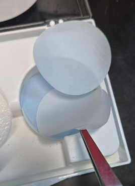
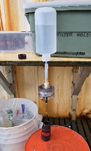

  

---

# Protocol for Nutrients Sampling 
**Author(s):** Xinya Calhoun  
**Lab:** Sawall Lab / MABEE Lab  
**Version:** v1.0  
**Date:** 2025-11-13

## Overview: 

This protocol is used for the collection of water samples for the purpose of analyzing for nutrient content.

Be sure to wear gloves for the entire process! Testing for nutrient content is very sensitive.

## Contents
- [Materials](#Materials)  
    - [Purchasing new materials](#Purchasing_new_materials)
- [Preparation](#Preparation)  
- [Sample Collection](#Sample_Collection)  
- [Analysis](#Analysis)  
- [Cleanup](#Cleanup)  
 
## <a name="Materials">Materials</a>

Most materials are stored on a shelf in room 305, in a green plastic box with a green lid labeled “Nutrients”.

- Gloves
- Nuclepore 47mm Circular Filters

  

-	Tweezers to handle filters
-	Filter holders
-	Bottle with Nutrients Sampling (bottle modified for nutrient sampling)
    - There is a small hole in the bottom of the bottle to promote water flow
-	Amber bottles for sample collection
    - Appropriate labels should be added via electrical tape
 -	Cooler filled with ice
 -	HCl

### <a name="Purchasing new materials">Purchasing_new_materials</a>
-	Filters can be purchased by ordering online (sold by various websites, eg. [Cytivia](https://www.cytivalifesciences.com/en/us/products/items/whatman-nuclepore-polycarbonate-hydrophilic-membranes-p-06195)).
-	HCl and can be ordered through Lab Operations ([Yasah Pitcher](ypitcher@bios.asu.edu); [Jess Godfrey](Jessica_Godfrey@bios.asu.edu)).              

## <a name="Preparation">Preparation</a>

1.  Use the tweezers to remove a filter from the filter container.
      Note: the filters are clear and are separated by blue round sheets.

  

*Clear filter being removed from storage box*

2.  Untwist and separate the two parts of the filter holder and use the tweezers to put a filter inside (on the half with the grid), place the O-ring onto the filter, then close the filter holder again.
      Note: the filter must be placed very flat and uniform, and the filter must be closed carefully to keep the filter flat.

## <a name="Sample Collection">Sample_Collection</a>
     
1. Collect water from the middle of the water column by putting the bottle into the column upside down and then tipping it rightside up once in the middle of the water column.
2. Rinse the bottle 3x with the sample water before collecting a full sample.
3. Attach the filter to the top of the bottle, placing the bottle upside down so the water can drip out of the filter and into the amber bottle.
    a. The bottle can be propped up to sit upside down, and the amber collection bottle can be set down as the water filtration can be a slow process.
    Note: the water may drip very slowly out of the filter.
    Note: DO NOT squeeze the bottle, the sample should be collected through gravity flow rather than pressure.
4. Rinse the amber bottle 3x with the filtered sample water before filling the bottle, leaving enough headspace in the bottle for the sample to expand as it freeze.
5. Place the filled amber bottle in the ice cooler.
6. After all samples are collected, put all the samples in a labeled plastic bag and place the plastic bag in a -20°C freezer.
7. Filter can be thrown in the garbage.
    

  

*Potential sampling setup*

  

*Potential sampling setup using alternative sampling bottle (not stored in the Nutrients box)*

  
## <a name="Analysis">Analysis</a>
 
Nutrients analysis is conducted by Becca May (rebecca.may@bios.asu.edu) from the BATS Team, and are sent along once all samples from the season are collected.

1. Communicate with Becca to determine which freezer on the 3rd floor of Naess the nutrients samples should be moved to.
2. Collect all of the samples into labeled plastic bags (grouped accordingly to when they were sampled and for which project) and place the bag in the freezer.
3. Create a spreadsheet including a list of sample IDs and send it to Becca.

| Bag ID | Bottle ID |
|--------|----------------|
| EddyReef_20250814 | 25A-NUTS-80 |
| EddyReef_20250814 | 25A-NUTS-60 |
| EddyReef_20250814 | 25A-NUTS-40 |
| AU_20250905 | A5 |
| AU_20250905 | A6 |
| AU_20250905 | A7 |

*Example spreadsheet*

## <a name="Cleanup">Cleanup</a>

- Amber Bottles need to be retrieved from the BATS Lab
- Bottles and disassembled filter holders should be soaked in an HCl bath for 2-3hrs, then rinsed with tapwater, then rinsed 3x with MQ, then hung/sat to dry.