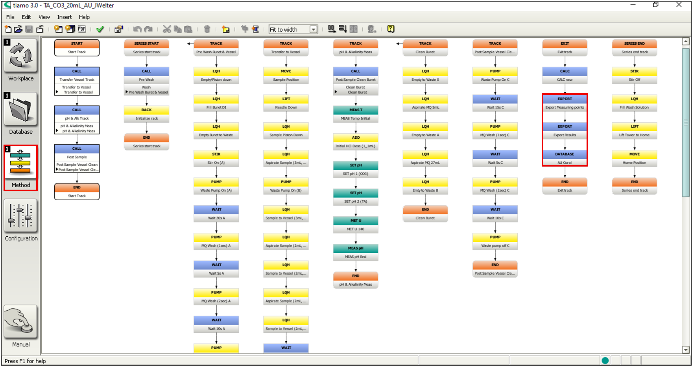
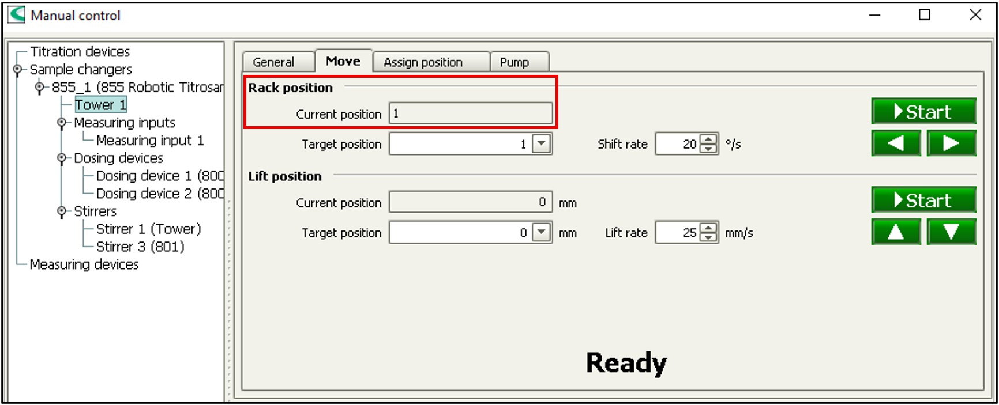

  

---

# Protocol for Analyzing Total Alkalinity
**Author(s):** Roderick Bakker, Xinya Calhoun  
**Lab:** Sawall Lab / MABEE Lab  
**Version:** v1.3  
**Date:** 2025-11-18

## Overview

This protocol is used for the estimation of carbonate (CO3) and/or total alkalinity (TA) through a 2-step titration process via the Metrohm Titrator and Tiamo software. A sample volume of 30-50mL is required; protocols are available for different volumes, but the different protocols cannot be mixed during a single run. 

Gloves for machine and sample handling! This lab sometimes uses HgCl2 so there could be traces.
No gloves for computer handling! 

## Contents

- [Materials](#Materials)
    - [Titrant](#Titrant)
    - [Samples](#Samples)
    - [Purchasing New Materials](#Purchasing_New_Materials)
- [Making Titrant](#Making_Titrant)  
- [Tiamo Software](#Tiamo_Software) 
    - [Databases](#Databases)
    - [Methods](#Methods)
    - [Export Templates](#Export_Templates)
- [Machine Preparations](#Machine_Preparations)  
    - [Start of Week](#Start_of_Week)
    - [Start of Day](#Start_of_Day)
- [Bubble Removal](#Bubble_Removal)    
- [Sample Preparation](#Sample_Preparation)  
    - [Notes](#Notes)
    - [Adding sample data directly into software](#Adding_sample_data_directly_into_software)  
    - [Adding sample data using CSV sample table](#Adding_sample_data_using_CSV_sample_table)
- [Conducting Titrations](#Conducting_Titrations)  
- [End of Day](#End_of_Day)  
- [Waste Disposal](#Waste_Disposal)  
    - [Clean Waste](#Clean_Waste)
    - [Spiked Waste](#Spiked_Waste)  
    - [Gloves, Aluminum foil, etc.](#Gloves,_Aluminum_foil,_etc.)
- [Data Processing](#Data_Processing)  
- [Storage](#Storage)  
- [Troubleshooting](#Troubleshooting) 
    - [Calibration](#Calibration)
    - [Volume](#Volume)
    - [Software was shut down](#Software_was_shut_down) 
    - [Broken equipment](#Broken_Equipment) 

<h2 id="Materials">Materials</h2>

Materials are mostly stored in room 305 of the Naess Laboratory building. Note that not all materials on this list need to be used each time samples are run.

<h4 id="Titrant">Titrant</h4> 

-	Balance/scale
-	HCl
-	Reagent+ grade NaCl
-	MilliQ water (aka MQ)
    
<h4 id="Samples">Samples</h4>

-	Collected samples
-	LNSW + bottles
-	Titrant
-	Styrofoam stands (if using falcon tubes)
-	Aluminum foil cut into small squares
-	White lids
-	MQ
-	HCl
-	pH testing strips
-	3mol KCl solution
-	CRMs
    
<h4 id="Purchasing_new_materials">Purchasing new materials</h4>

-	Aluminum foil can be purchased at stores on-island and reimbursed.
- pH testing strips can be ordered online or off-island.
-	HCl can be ordered through Lab Operations ([Yasah Pitcher](ypitcher@bios.asu.edu), [Jess Godfrey](Jessica_Godfrey@bios.asu.edu)).              
-	Metrohm solutions and parts (KCl solution, etc.) can be purchased through their [website](https://www.metrohm.com/en.html).
- Gloves can be purchased through the front desk at reception or through Lab Operations ([Yasah Pitcher](ypitcher@bios.asu.edu), [Jess Godfrey](Jessica_Godfrey@bios.asu.edu)).
    - If from reception must be charged to the Lab, ask Yvonne for the appropriate bank account code.
    
<h2 id="Making_Titrant">Making Titrant</h2>

Use fresh MQ and clean glassware! 

1. Mix 900mL MQ with 38.5g Reagent+ grade NaCl (located in a Ziploc bag in a drawer) in a 1L beaker. Mix occasionally over the course of 1-2 hours until the NaCl is fully dissolved. 
2. Add 2.78mL Reagent+ grade HCl (located in a bottle in the cabinet under the fume hood). 
3. Add more MQ so the total volume of the titrant solution is 1L (should add ~97.22mL of MQ).

For absolute TA measurements: use RM or CRM measurements to back calculate precise acid concentration. Adjust concentration in Tiamo software and R templates. 

If running a lot of samples (eg. over the summer field season) it’s best to make 4L at once in the big 4L amber bottle (blue label) and top up the smaller [amber titrant bottle](../../images/Metrohm_Titrator_&_Tiamo_Software/Titrator_Titrant_Bottle.png) (green label) as needed. This avoids having to restandardize.

<h2 id="Tiamo_Software">Tiamo Software</h2>

DO NOT close the Tiamo software application on the computer, it will reset the rack which may prevent the instrument from working (see [Troubleshooting](#Troubleshooting)).

<h4 id="Databases">Databases</h4>

Databases are locations to group data/records produced by analyzed samples

-	To find: Database -> File -> Database manager
   -	To create a new Database (if necessary): Database Manager -> right-click empty space and select “New”.
-	Databases are used to organize and group produced sample files together
-	Multiple Methods can be saved in one Database
-	Saving a method in a Database is done by modifying the method (see below).

<h4 id="Methods">Methods</h4>

Methods are step-by-step procedures that the instrument takes each time it analyzes 1 sample.

-	To find: Methods -> File -> Methods Manager
-	Methods can be created and customized for exactly what steps the user wants the instrument to do (eg. How many MilliQ rinses, how many mm the tower is lowered)
-	The general Method that is used for the titration of seawater samples in the MABEE Lab is “TA_CO3_20mL_AU_2024”. 
-	Each Method has its own export templates for the “res” and “mp” files.
-	If a new Method needs to be made in order to have different export templates but the same steps are desired, an old Method can be duplicated.
    -	Within the duplicated Method, find the EXPORT command labeled “Export Measuring Points” for exporting the “mp” files, and “Export Results” for exporting the “res” files, and modify them by selecting their respective export templates (see below to create export templates).
    -	Within the duplicated Method, find the DATABASE command, selecting the appropriate database to save the data in and labeling it as the database name.
-	Be sure to save the Method after any changes are made, or else they may not be applied.

  

*Method: TA_CO3_20mL_AU_JWelter*

<h4 id="Export_Templates">Export Templates</h4>

Export Templates are outlines for where the produced “res” and “mp” files from each analyzed sample will be saved in the computer’s File Explorer, and what metadata will be included in the produced “res” files from each analyzed sample.

-	To find: Database -> Tools -> Templates -> Export Templates…
-	Two files are exported for each titration reaction, one containing the raw measuring points (labeled “mp”; larger file ~20KB) and one containing the results: derived values (CO3, TA) and quality control metrics (temperatures & pH EP) (labeled “res”; smaller file ~1KB)
-	“Mp” file: 
    -	“File type” should be under “*csv. (Measuring point list)”
    -	“File name” should be under “Sample identification” and “ID1”
-	“Res” file:
    -	“File type” should be under “*csv. (Comma Separated)”
    -	“File name” should be under “Sample identification” and “ID1”
    -	The metadata included in the “res” file can be modified based on the metadata that is input into the IDs of the sample tables, as well as the results that need to be included
        -	When creating/editing a “res” export template, click “Select fields”
        -	There can be as many or as few “selected fields” as desired
        -	Each value from the “available field” can be given a simplified/clearer “displayed name”

  

*Tiamo windows for finding, creating, and editing Export Templates*

<h2 id="Machine_Preparations">Machine Preparations</h2>

<h4 id="Start_of_Week">Start of Week</h4>

These steps should be taken whenever the titrator has not run for 2 or more days.

1. Fill the rinse water jerry can with 10L FRESH MQ.
2. Mix titrant in amber bottle by swirling the bottle gently.
3. Perform a 3-point calibration.

<h4 id="Start_of_Day">Start of Day</h4>

These steps should be taken every day, regardless of if it is also the start of the week.

1. Check that the titrant bottle is at least half full (500mL = ~150 runs).
2. Check that the MQ reservoir has 5L or more (5L = ~30 runs).
3. Check/empty the waste water reservoirs (see [Waste Disposal](#Waste_Disposal)).
4. [Attach](../../images/Metrohm_Titrator_&_Tiamo_Software/Titrator_Latched_Pump2.png) the top of pump 2. 
    - The [black mark](../../images/Metrohm_Titrator_&_Tiamo_Software/Titrator_Black_Mark_Pump2.png) on the tube goes flush with the right-hand side of the base of the clip.
    - The tube should be within the large [groove](../../images/Metrohm_Titrator_&_Tiamo_Software/Titrator_Groove_Pump2.png) on the metal part of the holder.
5. [Open the electrode](../../images/Metrohm_Titrator_&_Tiamo_Software/Titrator_Open_Electrode.png) and top up with KCL (3-mol) by squeezing liquid from the KCl bottle into the hole.
6. Start the computer (login is written on tape on the computer).
7. Open the Tiamo software.
8. Check for bubbles in both Dosinos (aka Dosing devices) and the blue tube coming from the titrant bottle. 
9. If bubbles are present, proceed to “Bubble Removal”, if not, proceed to “Sample Preparation”.

<h2 id="Bubble_Removal">Bubble Removal</h2>

The waste line of pump 2 can be in the waste bottle with the green label for the duration of the bubble removal process.

1. Put a 50mL Falcon tube into the position directly under the injection needle.
2. In the Tiamo software: “Manual -> Tower 1 -> Move -> Lower the “Lift position” until the injection needle is lowered to ~150mm in the Falcon tube.
3. In “Tower 1”, start pump 2. 
    - Pump 2 drains the [sample beaker](../../images/Metrohm_Titrator_&_Tiamo_Software/Titrator_Sample_Beaker.png) - if the sample beaker isn’t draining, adjust the spring tension on pump 2 by twisting the [silver knob](../images/Metrohm_Titrator_&_Tiamo_Software/Titrator_Knob_Pump2.png) on the clasp.
4. In “Dosing Devices”, start “prepare” commands for both dosinos.
5. Wait until prepare commands have finished and liquid is fully drained out of the sample beaker.
6. Stop pump 2 and run pump 1 until sample beaker is full to ~25mL.
Note: don’t run pump 1 for too long or else the sample beaker will overflow.
7.	Check that air had been removed from the dosinos and the line coming from the titrant bottle. 
    - The line should be free of bubbles. For the dosinos: small air bubbles (1mm or smaller) are okay, but bigger bubbles should be removed by now. If not, repeat prepare commands as many times as required.
    -	If there is still a concerning amount of bubbles despite multiple prepare commands, the Dosino device can be taken apart to remove the bubbles (see Storage for instructions). 
8. In “Lift position”, raise the injection needle back to home position (0mm).
9. Empty Falcon tube into waste bottle with green label or into sink.

<h2 id="Sample_Preparation">Sample Preparation</h2>

<h4 id="Notes">Notes</h4>

1. Each sample takes ~10-12 minutes.
2. Low-nutrient seawater (LNSW) must be collected at the start of each group of samples being run (eg. samples collected at the same time for the same purpose) – collect a bucket half-full of water and then completely fill four or five 500mL plastic LMSW bottles.
    -	Each LNSW bottle should only be used for one day of titrations – once open the exposure to air will influence their TA.
3. The system usually takes 5-10 junk (LNSW) samples to prime all the lines and settle the electrode. If the machine has been run the previous day then 5-6 samples is sufficient, but if it has been sitting inactive for a couple days then more samples may be needed (8 or more).
    -	The system is ready for real samples if the TA value of 3 consecutive junk samples are (ideally) no more than ~3µmol apart (eg. 2185.59, 2184.01, 2186.44). A spread of 5µmol is acceptable.
4. The titrator takes a maximum of 24 samples at a time.
5. Samples can be added for a run into the Tiamo software directly, or a sample table can be made beforehand (as a CSV spreadsheet) and uploaded to the software.
6. More samples can be added to runs as the titrator is running, both into the software directly and as sample tables. 
7. Each sample requires (at minimum) a method, sample position, sample ID and salinity (in that order!).
8. Depending on the type of vial the sample is in as well as how full the vial is, the “Special position” will have to be changed to ensure enough sample is taken up:
    -	Falcon tubes (with Styrofoam stand): special position = 180mm
    -	Sample vials and 30mL threaded glass vials: special position = 187mm
9. 2 junk samples should be run between every ~12 real samples to ensure the system is still stabilized or to determine drift.

  

*Example junk sample template*

<h4 id="Adding_sample_data_directly_into_software">Adding sample data directly into software</h4> 

1. Go to the “Workplace” tab in the Tiamo software (top left corner).
2. Expand the “run” window (top right corner).
3. Clear the sample data tab if old samples are present (select any line of sample data and right-click -> delete).
4. Double-click the first line.
5. Select the desired method.
6. Add sample ID in the ID1 field.
7. Add sample salinity in ID2 field.
8. Other metadata can be added in ID3-ID8 fields.
9. Click “Apply” to add the sample to the table.
10. Use the arrows at bottom left hand corner to move to the next line and add more samples.
11.	Proceed to “Starting Titrations”.

<h4 id="Adding_sample_data_using_CSV_sample_table">Adding sample data using CSV sample table</h4>

Note: if samples are collected by another researcher, a template table can be sent to them for them to fill out and returned for running the titrations. Example templates are provided in the [Templates](../Total_Alkalinity_CO3/Templates) folder.

1. Copy the sample table template (or a previous sample table) to a daily folder (yyyyymmdd).
2. Add the correct date (yyyymmdd) to the template file and append with titration run number.
3. Add method name in column A (Method).
4. Add sample positions in column B (Sample Position).
    - For duplicates or triplicates, samples should not be run one after the other – alternate duplicates or triplicates with each other to account more for drift.

  

*Sample table with triplicates before and after alternating*                                                  

5. Add sample IDs in column C (ID1).
6. Add sample salinities is column D (ID2).
    - LNSW salinity is 36, sample salinity is dependent on water quality measurements.
7. Other metadata can be added in columns E-J (ID3-ID8).
8. Add titration volume in column K (Sample Size).
9. Add sample unit in column L (Sample Size Unit) (unit will be mL unless specified otherwise). 
10. Two vials of LNSW should be placed at the start and end of every batch of samples (every ~6 samples). For these only the method, position, salinity and vial number should be added (columns A-D). All other columns can be put as “NA”. 
    - Method: same as for samples
    - Position: position on sample rack
    - Vial: junk-# (number junks continuously throughout a day)
    - Salinity: 36
11. Delete the row with header information (row 1).
12. Store sample table as csv file.
13. Go to the “run” window in the Tiamo “workplace” tab.
14. Press “Sample table” at the bottom of the run window. 
15. Press “Import data”.
16. Find the stored sample table and open it to upload samples to the Tiamo software. 
    - If header information wasn’t deleted earlier this line should be deleted in the “run” window.
17. Proceed to “Starting Titrations”.

<h2 id="Conducting_Titrations">Conducting Titrations</h2>

Recall that at the beginning of the day the LNSW junks need to be run first! The following describes real samples but the steps for junks are relatively the same.

1. Un-spiked samples are kept in the fridge until they are run (for a week at most since they are un-spiked), but must be room temperature before titration. Take them out of the fridge and let them sit before analyzing.
2. Methods are available for 30mL and 50mL samples. 30mL samples go in [threaded sample vials](../../images/Metrohm_Titrator_&_Tiamo_Software/Threaded_30mL_Vials.png) and can be placed directly on the titrator. Larger samples and LSNW junks will have to be transferred to [50mL vials](../images/Metrohm_Titrator_&_Tiamo_Software/50mL_Vial.png). [50mL falcon tubes](../images/Metrohm_Titrator_&_Tiamo_Software/Falcon_Tube.png) may be used for sample collection as well, and must be placed in Styrofoam stands to keep them upright.
3. For 50mL samples, aliquot samples to sample vials to reach just under the blue fill line (fill line indicates ~40-50mL).
4. Cover sample vials lids, first with Titrator aluminum foil square, then with a white lid.
    - Foils must be manually cut from regular aluminum foil rolls and restocked occasionally.
5. Place samples on the titrator carousel in their appropriate positions.
6. Ensure waste line on pump 2 is in the waste bottle with the green label for un-spiked samples, and the red label for spiked (HgCl2) samples.
7. Place the white foam 50mL falcon tube holder in front of the sensor of the tower. 
    - Machine will not run without covering the sensor, unless official Metrohm beakers and beaker covers are used.
8. Import the desired sample table.
9. Double-check samples are in their proper positions on the carousel and match the sample positions in the sample table.
10. In the Tiamo workplace tab, press “Start”. 
11. Monitor the machine’s process of first titration as well as the results (under “Database”) to ensure (1) the samples are located properly on the carousel, (2) the waste pump is fully draining the sample beaker and (3) the titration reaction is running properly and produced reasonable results.
    - Ensure that the determination overview shows the correct database, or the results of each sample will not be shown: under “Database” go to File -> Open -> select the appropriate database -> Open.
12. After samples are run, the remaining sample liquid can be disposed of depending on the type (see [Waste Disposal](#Waste_Disposal)). 
    -	Vials containing LNSW or un-spiked samples: dump remaining liquid into the sink, rinse 3x with MQ and set to dry.
    -	Vials containing samples spiked with HgCl2: dump remaining liquid into the glass bottle with the yellow lid (located under the sink), rinse once with MQ and dump that rinse into the glass bottle, then rinse 3x with MQ and set to dry.

<h2 id="End_of_Day">End of Day</h2>

1. Top up electrode with KCl and [close](../../images/Metrohm_Titrator_&_Tiamo_Software/Titrator_Closed_Electrode.png) it.
2. [Unlatch](../../images/Metrohm_Titrator_&_Tiamo_Software/Titrator_Unlatched_Pump2.png) top of pump 2.
3. Move waste line on pump 2 back to waste bottle with green label. 
4. Discard remnants from sample vials into the appropriate waste bottle, wash each 3x with MQ and leave to dry.
5. Proceed to “Data Processing”.

<h2 id="Waste_Disposal">Waste Disposal</h2>

<h4 id="Clean_Waste">Clean Waste</h4>

1. [Nalgene bottle](../../images/Metrohm_Titrator_&_Tiamo_Software/Clean_Waste_Jug.png) with green label that says “Waste Water (clean)”
    -	Located on the counter
2. Used for junk samples and un-spiked seawater samples
3. Contains seawater, MQ, and Titrant
4. Can be dumped down the sink with running tapwater

<h4 id="Spiked_Waste">Spiked Waste</h4>

1. Rectangular [jerry can](../../images/Metrohm_Titrator_&_Tiamo_Software/Spiked_Waste_Jug.png) with red label that says “Waste Water (spiked/HCl)”
    -	Located on the counter
2. [Glass bottle](../../images/Metrohm_Titrator_&_Tiamo_Software/Small_Spiked_Waste_Jug.png) with yellow lid and red label that says “HgCl2 Mercury Chloride HgCl2”
    -	Located under the sink
    -	Used for the leftovers in sample vials, as well as rinse #1 with MQ
3. Used for samples spiked with HgCl2 
4. Contains seawater, MQ, Titrant, and HgCl2
5. Needs to be treated with HCl to lower the pH to ~3 (TEST WITH PH PAPER)
    - Jerry can full to 10L needs ~15ml of HCl
6. Bring wastewater to the mercury filter in the DIC Lab (discuss beforehand with [Becky Garley](Rebecca.Garley@bios.asu.edu))

<h4 id="Gloves,_Aluminum_foil,_etc.">Gloves, Aluminum foil, etc.</h4>

1. All things that come in contact with regular samples can be disposed of in the regular waste bins.
2. All things that come in contact with HgCl2 (gloves, aluminum foil, etc.) should be disposed of in a double-bagged biohazard bag that can be obtained from Lab Operations ([Yasah Pitcher](ypitcher@bios.asu.edu), [Jess Godfrey](Jessica_Godfrey@bios.asu.edu)).              
    -	Once biohazard bag is full, seal and return bag to Lab Operations.

<h2 id="Data_Processing">Data Processing</h2>

Note: see “Methods -> Export locations for data” to find exact locations for file exports. 

1. The files containing raw measuring points (mp) should be transferred to a date labelled folder (yyyymmdd) at the end of each day.
2. The files containing derived values (res) are used for the calculation of the calcification rates. As with the measuring points these files should be transferred to a folder labeled with the date (yyyymmdd).
3. The folder from step 3 should be copied to the appropriate dropbox or Google Drive folder for processing. 

<h2 id="Storage">Storage</h2>

Storage refers to when the system and the instrument will not be running samples for ~3+ weeks.

1. Swap [amber titrant bottle](../../images/Metrohm_Titrator_&_Tiamo_Software/Titrator_Titrant_Bottle.png) with the [clear Dosino storage bottle](../../images/Metrohm_Titrator_&_Tiamo_Software/Titrator_Storage_Bottle.png) (contains MQ).
2. Flush all lines and Dosinos with MQ using the machine commands (do not try to take off the lines and do it manually). After switching Titrant bottle for the Storage bottle, all inflows come from MQ - running the prepare commands a few times for both Dosinos is enough.
    -	Bonus: not necessary, but both Dosino units can be disassembled and rinsed with MQ to flush out any salt build up; Metrohm has instructional videos for [disassembling the sample Dosino](https://youtu.be/NHa0AXHTO-E?si=ftNoxO5LLXFLbEXw), and the titrant Dosino is the same process. After reassembly, run the “Prepare” command once or twice to ensure proper function. Tools required for disassembly are found in the drawer in room 305 marked “Metrohm”, in a Ziploc bag labeled “Tools”.
3. Place electrode in a storage tube with the Metrohm 3M KCl solution. Seal the storage tube with Parafilm to prevent the solution from desiccating.
4. Discard leftover waste and rinse out waste containers with MQ. 
5. Download a backup of the Tiamo results database, and upload the backup as well as all .csv result files to the Dropbox.
    -	Must do this before the computer is shut down long-term as it can take a while for the computer and Tiamo software to boot up again once they've been down for a while.
6. Acid wash and MQ wash all 50mL vials and 30mL threaded vials before storage.
    -	50mL vials can remain in the cupboard.
    -	30mL threaded vials go back in their cardboard boxes.

<h2 id="Troubleshooting">Troubleshooting</h2>

<h4 id="Calibration">Calibration</h4>

If values seem off, the lab has batches of [Certified Reference Material (CRM)](../../images/Metrohm_Titrator_&_Tiamo_Software/CRMs.png) solution, located in cupboard labeled “Seawater Standards, Spiked HgCl2”. These have been prepared by the Scripps Institution, with each respective batch’s salinity, TA and CO2 values published [online](https://www.ncei.noaa.gov/access/ocean-carbon-acidification-data-system/oceans/Dickson_CRM/batches.html). Run some samples of an UNOPENED bottle of solution (if already opened then the values will not be accurate due to air exposure) using their salinity, and if the CO2 and TA results do not match those published by Scripps (be sure to correspond the batch number to the number on the website) then there is something off with the system’s readings and offset must be accounted for.

Note: the Scripps solutions are spiked with HgCl2!

If new CRMs need to be purchased, email co2crms@ucsd.edu and they will provide an order form.

<h4 id="Volume">Volume</h4>

The titrator needs to take up a certain amount of volume depending on the Method, and depending on the vial (50ml glass vials, 30ml threaded vials, falcon tubes, etc.), the tower needs to lower more to take up enough volume of the sample. If it does not, the TA values may be much lower or will read “invalid”. See [Sample Preparation](#Sample_Preparation) -> Notes -> step 8.

<h4 id="Software_was_shut_down">Software was shut down</h4>

If the computer is shut down or the application is closed, the software will reset and may give error messages when trying to move the tower for bubble removal, as it will not be able to read the rack position: “Current position” (under Manual -> Tower 1 -> Move -> Rack position) will read “-----" instead of the number value that corresponds to the rack position directly under the tower.

  

*Rack position reading “-----", indicating error in function and connection between the instrument and software*

To fix: set up one junk sample in the Workplace and start it. The system should begin running as usual – you can press “Stop” once the tower begins to lower as though to take up the sample. When “Stop” is pressed, everything will stay as it was while “Stop” was pressed, so go into “Manual”, stop the stirrer and move the Lift position back to 0. “Current position” should now read the number value that corresponds to the rack position directly under the tower. Proceed with bubble removal.

  

*Rack position reading a proper position, indicating proper function and connection between the instrument and software*

<h4 id="Broken_Equipment">Broken Equipment</h4>

Broken parts can simply be replaced – there are spare parts in the drawer in room 305 marked “Metrohm”, in a Ziploc bag labeled “Spare Parts”. If parts required are not in the drawer, they can be replaced by ordering from the [Metrohm website](https://www.metrohm.com/en.html).

