

  

---

# Protocol for Nutrients Sampling 
**Author(s):** David Jen, Xinya Calhoun  
**Lab:** Sawall Lab / MABEE Lab  
**Version:** v1.2  
**Date:** 2024-07-13

## Overview 

This protocol is for the analysis of live corals (or other objects) for the purpose of creating 3D models using Agisoft Metashape Pro to collect surface area and volume measurements.

## Contents

- [Setup](#Setup)  
- [Video Collection](#Video_Collection) 
    - [Notes](#Notes)  
    - [Recording](#Recording)
- [Agisoft Metashape Pro Model Creation](#Agisoft_Metashape_Pro_Model_Creation)  
    - [Importing Videos](#Importing_Videos)
    - [Generating Photo Cloud](#Generating_Photo_Cloud)
        - [Photo Cloud Troubleshooting](#Photo_Cloud_Troubleshooting)
    - [Batch Processing to Generate Model](#Batch_Processing_to_Generate_Model)
- [Markers and Scale Bars](#Markers_and_Scale_Bars) 
    - [Creating Markers](#Creating_Markers)
    - [Creating Scale Bars](#Creating_Scale_Bars)
- [Volume/Surface Area Measurements](#Volume/Surface_Area_Measurements)  
    - [Measuring Volume](#Measuring_Volume) 
    - [Measuring Surface Area](#Measuring_Surface_Area)
 
<h2 id="Setup">Setup</h2>

The platform the corals are placed on must have distinguishable markers on them for the software to recognize and for scale bars to be created. The platform should be black, and the markers should be bright contrasting colours, with small but visible dark-coloured dots/shapes – the scale bars will be made between these dots, so they must be small but distinguishable.

The following is an example of a platform set-up using Agisoft markers, but markers can be customized to user preference:

1. In Agisoft, Tools -> Markers -> Print Markers 
2. Attach markers to the disk-shaped base that holds the coral plug (see below). Record measurements of the distances between each of the markers.

  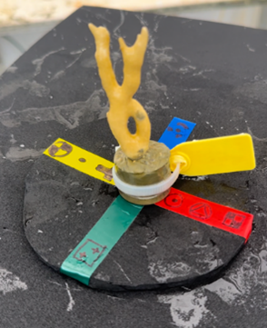

*Platform with Agisoft markers*

The MABEE Lab has two platforms that can be used for 3D models. The above one is smaller and typically for fragments, and the below one can be used for full colonies.

  

*Larger platform with painted markers*

<h2 id="Video_Collection">Video Collection</h2>

<h4 id="Notes">Notes</h4>

1. Ideally, the recorder must have enough space to walk all the way around the platform in order to film the coral from all angles, while also keeping at least two markers in frame at a time. The following is a suggestion of how to take a video:
2. Aim for about 30 seconds per video. For lower fps cameras, move the camera slower when filming the coral.
3. Ensure the platform doesn’t have any water droplets on it, as the software can pick this up as texture and distort the marker locations and thus the scale bars.
4. Minimize glare or shadow in the video as much as possible, as these can make it harder for the software to read the images and align them to other images. 

<h4 id="Recording">Recording</h4>

1. Holding the camera at side-profile of the coral, walk around the coral until you reach where you began (360° turn around the coral).
2. Make one more 360° turn around the coral, gradually raising the camera angle until you end the video with the camera directly on top of the coral, pointing downwards.
3. Import video(s) onto the computer, sorting files from each coral into a separate folder. 

<h2 id="Agisoft_Metashape_Pro_Model_Creation">Agisoft Metashape Pro Model Creation</h2>

In Agisoft Metashape Pro, create a project, then name and save it. Different projects can be made for different coral groups (eg. Ambient Corals and Heated Corals), but the same corals in a group can be input into the same project as chunks and can be run in batch processes. It is not necessary to use chunks – if desired, each coral can be a different project. The below instructions can be used for any number of chunks.

<h4 id="Importing_Videos">Importing Videos</h4>

1. Right-click  “Chunk 1” -> Rename.
2. Right-click  “Chunk 1” -> Import -> Import Video -> select the desired video.
3. Choose output folder (see below).
4. Input Frame Step - this is the number of frames you want created from the video (see below). Change this according to the fps of the camera. If inherent fps is high, a frame step of 15 will generate roughly 75 frames for a 30 second video. Play around with the number until satisfied with the number of frames generated – a lower frame step value means more photos are generated. 70-100 frames per video is more than enough. 
5. “Start from” and “End from” can be left as-is (see below), and the software will automatically create frames using the whole video.
6. Select “Ok”.

  

If using multiple chunks:

7. Click “Add Chunk” in the Workspace (see below).

  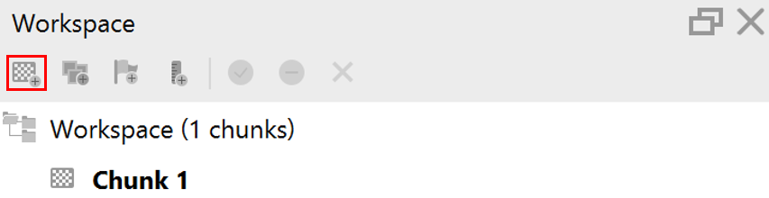

8. Follow steps 1-6 until all chunks are created.

<h4 id="Generating_Photo_Cloud">Generating Photo Cloud</h4>

1. Look through the frames generated (they will appear in the bottom “Photos” panel) and remove any that are not wanted for creating the model (blurry, distorted, blocked, etc.).
2. Workflow -> Batch Process -> Add -> Job Type -> Align Photo (see parameters below) -> Ok
    - If the project has multiple chunks and the job needs to be run for all the chunks, ensure that “Applies to -> All chunks” is selected.
  

  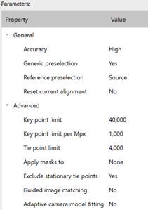

3.Check coverage and alignments (alignment problems occur if on the platform are not properly detected in the image; if misalignment occurs see “Troubleshooting”).
    - To check coverage, click the [camera button](../images/Agisoft_Camera_Button.png) along the top taskbar and a photo cloud should appear. 
    - Aim for coverage roughly like below:
    

  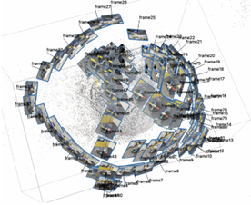

<h4 id="Photo_Cloud_Troubleshooting">Photo Cloud Troubleshooting</h4>

A. If the coverage does not look like enough to accurately generate a model from all angles, another video of the same coral can be added to the same chunk by following the steps under “Importing Videos”, and then coverage can be re-checked by following the steps under “Generating Photo Cloud”.

B. If there are alignment issues, the system will say there are misaligned photos.
    1. In Workspace, select the chunk with misaligned photos and its drop-down menu will appear.
    2. Select “Images” – it will say how many images are aligned, and the misaligned frames will appear with “NA” (see below). 
        a.	If there are very few misaligned images (less than 20%), their absence won’t negatively affect the model, and coverage is good already, remove the misaligned photos. 
        b.	If there are many misaligned images, remove all images and import the video again with a different Frame Step value.

  

3. If there are still alignment issues, manually crop any useless background from the images to reduce what the system needs to filter out.
4. If there are still alignment issues, the video might not be good enough to properly generate a model. Re-record the video if possible.
     
<h4 id="Batch_Processing_to_Generate_Model">Batch Processing to Generate Model</h4>

The next four jobs (Optimize Alignment, Build Point Cloud, Build Mesh, Refine Mesh) are being lined up to run automatically after the prior job is completed. This is not necessary and you can run the jobs one at a time if desired – to do so, simply skip to step 6 after each job (Note: all 4 jobs still must be run).

1. Workflow -> Batch Processing -> Select “Align Photos” -> Remove. 
2. Add -> Job Type -> Optimize Alignment (default parameters) -> Ok.
3. Add -> Job Type -> Build Point Cloud (see parameters below) -> Ok. 

  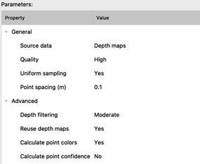

4. Add -> Job Type -> Build Mesh (see parameters below) -> Ok.

  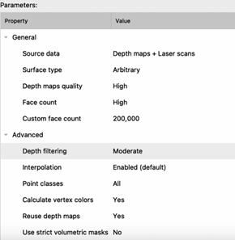

5. Add-> Job Type -> Refine Mesh (see parameters below) -> Ok

  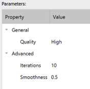

6. Below is what the job lineup should look like. Once ready, checkmark “Save project after each step” -> Ok. 
    - The checkmarks mean that the jobs will be run when pressing “OK”. If a job fails, they do not all need to be removed – simply uncheck the ones you don’t want to run.

  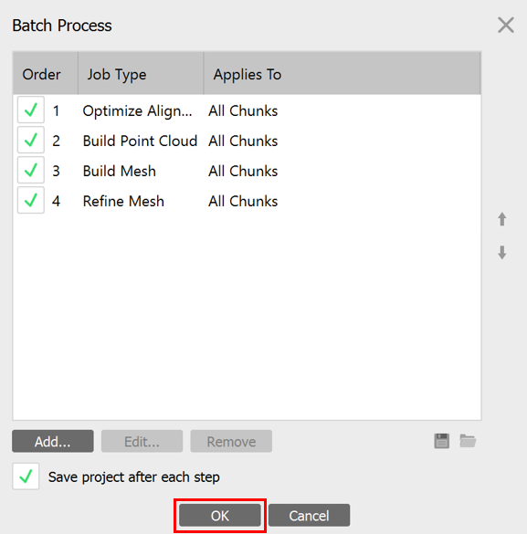

7. The final product should look like this: 

  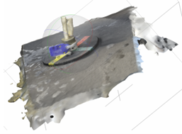

<h2 id="Markers_And_Scale_Bars">Markers and Scale Bars</h2>

<h4 id="Creating_Markers">Creating Markers</h4>

1. Tools -> Detect Markers -> Marker Type : Circular 12 bit -> Ok.
    - Markers will appear on the model and on the images, and their names will appear in the Reference panel (bottom left corner).
        - Markers will automatically be labeled “point 1”, “point 2”, etc. If desired, markers can be renamed by double-clicking on the current label.
    - If this doesn’t work and markers don’t appear, manually add markers by right clicking on the location where you want a marker to be placed and selecting add marker. 
2. The markers the software created on the images will be flagged as blue (confident) or white (unconfident). Manually moving the markers flags them green. For each marker, manually move the markers to where they should be on different image so at least four marker replicates are flagged as green.
    - Moving the markers on the images influences the markers on the model. If the model is properly made, more green flags means more accuracy on the model.

<h4 id="Creating_Scale_Bars">Creating Scale Bars</h4>

1. Click "Reference"" located in the bottom left corner. Select 2 markers (hold Ctrl + click on the markers) that you’d like to make a scale bar between. 
    - Selected markers will be grayed out. Do not use the check boxes to select, as they do not work.
2. Right click on the selected markers -> Scale Bar
3. Double-click space under “Distance(m)” next to the created scale bar to manually enter the scale according to real life measurement. 
4. Repeat steps 1-3 for different combinations of markers to create as many scale bars as desired. 
5. Once satisfied, press the [update transform button](../images/Agisoft_Transform_Button.png). The model will then be updated according to scale.
    - Tip: Press 0 to reset the view of the model post-transformation. 
6. The final product should look like this:

  

7. If desired, to hide the points and scale bars from view, press the [flag button](../images/Agisoft_Flag_Button.png).

<h2 id="Volume/Surface_Area_Measurements">Volume/Surface Area Measurements</h2>

1. Save the project (to save the model as-is), then save it **again** as another name (eg. “file_name_CUT”). The following steps will greatly modify the model and it is a good idea to also have a copy of the original model.
2. Open the dashed rectangle’s drop-down menu and select “Free-Form Selection” (see below).

  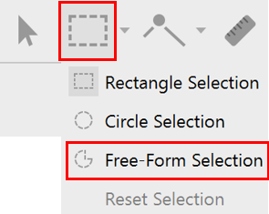

3. Press and drag over the coral, epoxy, base/plug, and tag. Selected area will turn pink – this is what will be KEPT.
    - Do not attempt to crop out everything at once – go over the model multiple times, taking smaller and smaller pieces out to be as accurate as possible.
4. Remove the non-selected area by pressing the button below: 

  

5. Repeat to crop out everything other than the coral, epoxy, base/plug, and tag. 
    - Ensure to check over the coral after cropping each time. Since it is a 3D model and it can overlap with part of the model behind it, it is easy to accidentally crop out a piece of the model that you want to keep.
6. The final product should look like this:

  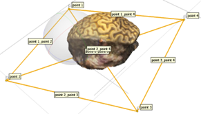

<h4 id="Measuring_Volume">Measuring Volume</h4>

1. Tools -> Mesh -> Close Holes -> Level 100% -> Ok.
    - To measure volume, the model cannot have any holes (hence closing the holes). The only hole at this point (before closing it) should be the bottom of the model. If the hole is not properly closed, volume will be 0.
2. Tools -> Mesh -> Measure Surface Area and Volume. This will produce an Area (m^2^) and a Volume (m^3^) value based on the model.
3. Record values elsewhere – values are not saved on Agisoft.
    - The Area value produced here is not the one we want (though record it for the sake of datakeeping) – we will be generating another one.
    
<h4 id="Measuring_Surface_Area">Measuring Surface Area</h4>

1. Use “Free Form Selection” to crop the model again, keeping only the living coral portions.
2. The final product should look like this:

  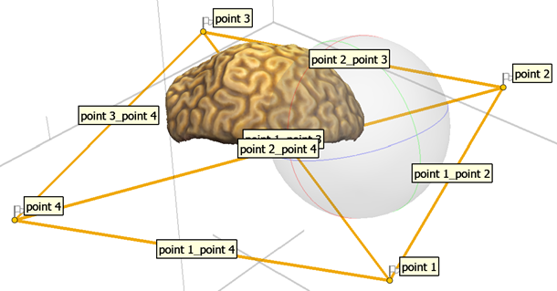

2. Tools -> Mesh -> Measure Surface Area and Volume. This will produce an Area (m^2^) value; the Volume value will be 0.
3. Record values elsewhere – values are not saved on Agisoft.
