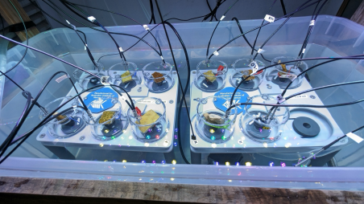
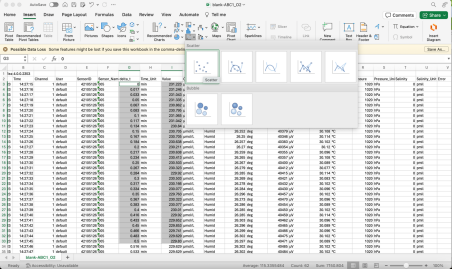
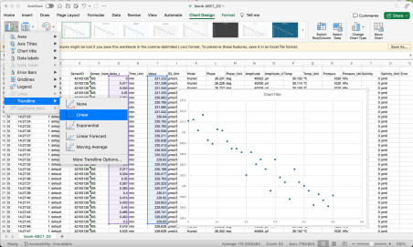
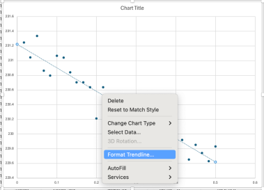
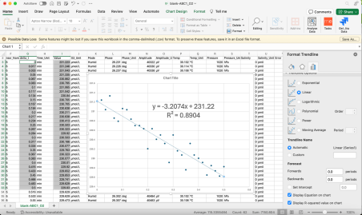
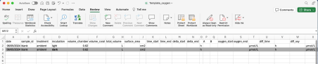

# Coral Incubations Protocol

**Author(s):** Janna Hynds
**Adapted from:** Dr. Chloe Carbonne
**Lab:** Sawall Lab
**Version:** v1.0
**Last edited:** 2026-09-14

## Overview

This protocol covers coral respirometry incubations (colony and fragment level) using PreSens Oxy-4 SMA oxygen/temperature probes and PreSens Measurement Studio 2, including chamber setup, running light/dark incubations, and calculating respiration and photosynthesis rates from the exported data.

- Setting up computer on PreSens (loading colony names and assigning channels etc)
- Setting up Oxy 12
- Setting up lights and inside trailer incubation set up
- Setting up outdoor colony size incubation

## Contents

- [Coral COLONY Incubation protocol](#coral-colony-incubation-protocol)
- [Coral FRAGMENT Incubation protocol](#coral-fragment-incubation-protocol)
- [Using PreSens Oxy-4 Software](#using-presens-oxy-4-software)
- [Measuring Volume of the coral](#measuring-volume-of-the-coral)
- [Measuring Surface area of the coral](#measuring-surface-area-of-the-coral)
- [Data Analysis](#data-analysis)

---

## Coral COLONY Incubation protocol

*tbd*

---

## Coral FRAGMENT Incubation protocol

### Materials

- At the Bermudian Mesocosms Facility
- 3 PreSens Oxy-4 with 4 temperature and oxygen probes each, 2 lamps
- 2 spinning tables for 6 incubation chambers from AIMS
- 2 battery chargers
- 12 620mL incubation chambers from AIMS
- 12 magnetic stirring bars
- 1 tank used as a water bath to control the water temperature in the incubation chambers
- 1 chiller
- 1 heater
- 1 chiller/heater temperature controller
- 1 computer with PreSens software

### Tank preparation (lab teacher)

Before starting the incubation, the water in the tank must have reached the incubation temperature. Fill the tank with seawater until the water reaches almost the top of the incubation chambers and turn on the temperature controller. It will automatically measure temperature and turn on the chiller or heater.

Check the batteries of the spinning tables.

For net photosynthesis measurements, turn on the lights. Measure the light intensity with a PAR sensor and adjust the light.

For dark respiration, turn off the lights, cover the tank with a tarp, and wait 5 min.

### Sample preparation (students)

Corals are fixed on plugs with epoxy (or any other organisms that fit in the chambers and allow water to move around). Clean the base of the coral with a toothbrush to take off all organisms that grew on the plug and epoxy (we only want the coral respiration or photosynthesis).

Write down the name of the samples you are going to use on the PreSens software and link the name to one of the 12 channels. **One channel must be a blank, only with seawater.**

As soon as the seawater in the tank has reached temperature, we can prepare the incubation chambers with the corals. Secure the plug of the coral on the base of the incubation chambers. Be careful to choose the incubation number that corresponds to the channel you selected for the samples. Add a magnetic stirrer to each incubation chamber. Submerge the two parts of the incubation chambers under the water and carefully close the chamber. **The chambers SHOULD NOT have ANY air bubbles**, which could highly modify the oxygen probe readings.

Turn on the spinning table. Secure each incubation chamber on the spinning table, being careful about the number of the incubation chamber — it needs to be on the same number on the tables. Plug the temperature and oxygen probes into the two holes of the incubation chamber, and choose the probes that have the same number as the incubation chamber.

As soon as all the chambers are on the spinning tables with probes, and all of them have a spinning magnetic stirrer, start the run on the PreSens software.

Usually, we start with light measurement for 30 min, then turn off the light and do dark measurements for 30 min, with no pause in between. **Write the start and end times for both light and dark runs.**

---

## Using PreSens Oxy-4 Software

### Coral Respirometry Incubations with PreSens Oxy-4 SMA / Measurement Studio 2

**System:** 3 x OXY-4 SMA (4-channel O2 meters), each paired with 4 temperature probes, run through **PreSens Measurement Studio 2**.

**Chamber layout:**

| Box | OXY-4 SMA unit | Channels |
|-----|----------------|----------|
| Box 1 | Device A | 1, 2, 3, 4 |
| Box 2 | Device B | 5, 6, 7, 8 |
| Box 3 | Device C | 9, 10, 11, 12 |

> **Note:** the software addresses channels per-device as 1–4 on each OXY-4 SMA unit (identified by its serial number, e.g. "OXY-4 SMA, O2 5ADO0002000337 – Box 2"). We keep a printed or taped label on each device stating which physical Box (1/2/3) and which incubation channel number (1–12) it corresponds to, since the software itself only shows Channel 1–4 per device. *(If confused, look to the sensor number rather than the channel number when assigning names.)*

#### 1. Before you start (bench setup)

1. Fill each incubation chamber with filtered seawater at the target temperature, add a stir bar, and place on the stir plate.
2. Load coral fragments/colonies into chambers, seal lids, and confirm no air bubbles are trapped under the lid or on the sensor spot. Use your thumb to cover both holes where the sensors are inserted when transporting corals from the basins to the incubation set up.
3. Confirm each O2 optical fiber and temperature probe is fully seated in its sensor holder/spot on the chamber, and that cables are connected to the correct numbered channel on the correct OXY-4 SMA box.
4. Turn on all three OXY-4 SMA units and the Durabook laptop.

#### 2. Opening the software

1. Open **PreSens Measurement Studio 2** from the desktop/taskbar.
2. The software window has four main tabs across the top:
   - **Live View** – where you start/stop/monitor an active run in real time.
   - **Management** – where you assign measurement names, sensors, and settings to each physical channel before/between runs.
   - **Measurements** – a library of all saved measurement names/datasets (create, rename, delete, export).
   - **Sensors** – sensor/calibration records for each optical O2 sensor.
3. Confirm all three OXY-4 SMA devices appear in the device list (each shown as "OXY-4 SMA, O2 [serial number] – Box #"). If a box is missing, check the USB/serial connection before continuing.

#### 3. Creating measurement names (Measurements tab)

Do this first, before assigning channels — it's easier to build the full list of names once, then assign them.

1. Go to the **Measurements** tab.
2. Click **New** on the ribbon to create a new measurement entry.
3. Name it using your labeling convention (e.g. `treatment_coralID_date`, matching how/if you name PAM/other datasets — e.g. `Heat_7_P11A`).
4. Repeat for every coral/chamber you are running that session (12 names for a full 3-box run, or fewer if some channels are running blanks/controls).
5. Use **Rename** to fix typos and **Delete** to remove unused/duplicate entries. **Export** lets you pull out a finished dataset once a run is complete (see Section 7).

> Tip: leftover names from previous runs stay in this list — either reuse and rename them, or delete old ones so the dropdown in Management stays uncluttered.

#### 4. Assigning names to channels (Management tab)

1. Go to the **Management** tab. You'll see a block for each OXY-4 SMA device (labeled with its serial number and box), each with rows for Channel 1–4, and columns for **Measurement**, **Sensor**, **User**, **Grouping**, and **Output**.
2. For each channel row, click the **Measurement** dropdown and select the coral/chamber name you created above that corresponds to the physical chamber plugged into that channel.
   - Double-check physical channel = correct coral. It's easy to swap/confuse cables; verify by matching the cable's channel number label to the row you're editing.
3. Confirm the **Sensor** column shows the correct sensor ID for that channel/cable (each optical fiber has its own sensor number, e.g. 001–012) — this determines which calibration is applied.
4. *(Not usually necessary:)* If a sensor's calibration is out of date, select it and click **Calibrate** on the ribbon to run/update a 2-point (0% and 100% air-saturation) calibration before starting the run.
5. Once every channel across all three boxes is correctly named and matched to a sensor, click **Activate** on the ribbon for each channel (or select all and activate together) so they're live and ready to record. **Deactivate** any channel not in use for this run (e.g. an empty chamber) so it doesn't clutter the run or throw errors.

#### 5. Starting a run (Live View tab)

1. Switch to the **Live View** tab. You'll see the same device/channel layout, now with live columns: **Value** (O2), **Temperature**, **Pressure**, **Time**, **Recording** status, **Unit**, **Interval**, **Planned end**, and a **Temperature** source column (Auto/Manual).
2. Set the **Unit** (e.g. % air saturation or µmol/L, matching your prior runs).
3. Set the **Interval** (how often a reading is logged, e.g. every 5–15 seconds) and the **Planned end** (run duration/stop time) — apply the same settings across all channels if you want a synchronized run.
4. Set **Temperature** to **Auto** for any channel with a connected temperature probe (it will read live temperature and auto-compensate the O2 calculation). Only use **Manual** and type in a fixed value if that channel has no temperature probe attached — this is less accurate, so avoid it if a probe is available. (We usually use ambient temperatures (28°C) or heated temperatures (typically 30.5°C).)
5. Before pressing Start, do a quick visual/functional check on the bench:
   - **Stir bars spinning** in every chamber (you should see a visible vortex in each jar; if one has stopped, nudge the stir plate speed or reseat the bar).
   - **No bubbles** trapped against the O2 sensor spot or under the lid.
   - **Lids fully sealed** (no gas exchange with room air).
   - Readings in the **Value** column are stable and physically plausible (e.g. O2 near 100% air saturation at the start for a well-mixed, aerated chamber; temperature matches your target ±0.2 °C).
6. Click **Single Scan** on any channel to take one manual reading as a check before committing to a full recording — confirm the value looks sane and updates when you gently agitate the chamber (a responsive sensor spot).
7. Once everything checks out, click **Start** to begin the synchronized run across all active/activated channels (or start box-by-box if you're staggering runs). The **Recording** column will change to "active" for each running channel.
8. Use **Pause**/**Stop** only if you need to interrupt the run (e.g. to fix a stalled stir bar); resuming after a pause can introduce a gap in the timeseries, so note the pause time in your notebook.

#### 6. Monitoring during the run

1. Periodically check the **Live View** screen for:
   - Any channel whose **Recording** status has dropped from "active" (signal lost, cable disconnected, or sensor error).
   - O2 values declining steadily and roughly in parallel across replicate chambers within a treatment (flags a stalled stir bar or leak if one channel is flat while others decline).
   - Temperature holding steady at the target (drift indicates a probe issue or a water bath/incubator problem).
2. Use **Show Graph Overview** or **Show Correlated Graph Channels** on the ribbon to visually compare all channels' O2 traces in real time — a fast way to catch outliers (flat lines, spikes, or noisy/jumpy traces indicating a bubble or bad sensor contact) without checking every channel manually.
3. Walk the physical boxes periodically to visually confirm every stir bar is still spinning and no lids have popped/leaked, since the software can't detect a stopped stir bar directly — it only shows up indirectly as a flattened O2 decline curve.

#### 7. Ending the run and exporting data

1. Click **Stop** once the planned incubation time has elapsed (or it will stop automatically at the **Planned end** time you set).
2. Remove corals, note final chamber water temperature with an independent thermometer as a spot-check against the logged temperature, and rinse/set up chambers for the next run.
3. Go to the **Measurements** tab, select the completed measurement name(s), and click **Export** to save the raw O2/temperature/time data (CSV) for respiration-rate calculations.
4. Rename or archive used measurement names so they aren't accidentally overwritten/reused in the next run.
5. **Deactivate** all channels in the Management tab when finished, ready to reassign new names for the next incubation session (light vs dark, next day's corals, etc.).

#### Quick pre-run checklist

- [ ] All chambers filled, sealed, no bubbles
- [ ] Stir bars spinning in every chamber
- [ ] Correct coral/chamber name assigned to correct channel (Management tab)
- [ ] Sensor calibration up to date
- [ ] Temperature set to Auto (probe attached) for every channel
- [ ] Interval and planned end time set
- [ ] Single Scan check looks sane before pressing Start

---

## Measuring Volume of the coral

### Volume of the coral (students)

In order to know the volume of water in the chamber, we need to know the total volume of the chamber (0.62 L) and subtract the volume of the coral.

To measure the volume of the coral, we place a container (1) with water filled to the top, inside an empty container (2). We then immerse the coral inside the container (1) with water by holding the coral from the tip of the tag. The overflowed water in container (2) corresponds to the volume of the coral. The water in container (2) is poured into a measuring cylinder to get the volume.

---

## Measuring Surface area of the coral

### Surface area of the coral (students)

The surface area of the coral is the living tissue surface area of the coral, the part that breathes and photosynthesizes. The surface area of the coral will help us standardize the respiration and photosynthesis rates between every coral so we can compare them. Take a picture from the top of the coral with a ruler as a scale.

---

## Data Analysis

### Data analysis (students)

**Software needed:** Excel and [ImageJ (Fiji)](https://imagej.net/software/fiji/downloads)

After finishing the run, the .csv files are saved into the computer and sent to the students.

The .csv file has a lot of columns but only a few are interesting:

- **"time"**: the time when the incubation was running; notes of the time have been taken at start and end time for light and dark incubations.
- **"delta_t"**: the number of hours from the start of the incubation when an oxy measurement has been taken.
- **"Value"**: the oxygen concentration in µmol/L.

### Coral surface area measurement

The coral surface area is obtained from the pictures taken from the top of the corals, analyzed on the software ImageJ (to be downloaded before the lab).

### Blank analysis

The blank is used to take off any background oxygen from respiration or photosynthesis from microorganisms in the water.

1. Open the blank .csv file in Excel.
2. Select the data from "Value" and "delta_t" from the start and end time of the light measurement.
3. Insert a graphic with scatter points: "Value" in y and "delta_t" in x.

4. Draw a regression line and add the equation, as shown below.

The equation format obtained is **y = Ax + B**.

### Filling in the template

Open the Excel sheet template sent to the students.

Fill in the volume of the coral, the surface of the coral, the time start, time end, delta_start, delta_end, and A and B obtained in the equation. (For the blank: the volume is 0, the surface area is 1.)

> **Note:** `delta_start` is pulled from the `delta_t` column in your metadata in the same row as your start time, as is `delta_end`, correlating with your end time.

The calculations proceed as follows:

- **`total_volume`** = `volume_chamber` − `volume_coral`
  *(Make sure `volume_coral` is in L, not mL.)*

- **`oxygen_start`** = `A` × `delta_start` + `B`
  Measures the concentration of oxygen at the start of the incubation, using the equation obtained.

- **`oxygen_end`** = `A` × `delta_end` + `B`
  Measures the concentration of oxygen at the end of the incubation, using the equation obtained.

- **`diff_time`** = `delta_end` − `delta_start`
  The duration of the incubation.

- **`diff_oxy`** = `oxygen_end` − `oxygen_start`
  The oxygen change for the duration of the incubation. Negative when oxygen has been consumed, positive when oxygen has been produced.

- **`oxy_quantity`** = `diff_oxy` × `total_volume`
  The quantity of oxygen dissolved in the volume inside the chamber.

- **`oxy_per_hour`** = `oxy_quantity` / `diff_time` × 60
  The total amount of oxygen produced/consumed per hour.

- **`corr_oxy_hour`** = `oxy_per_hour` of the sample − `oxy_per_hour` of the blank (matched for light or dark)
  **This is only applied to coral samples (not blanks)**, to account for oxygen changes due to the background.

- **`oxy_hour_surface`** = `corr_oxy_hour` / `surface_coral`
  The total amount of oxygen produced/consumed per hour for 1 cm² of coral tissue.

> When this has been done for the light incubation, repeat it for the dark incubation, and for both the coral samples' light and dark incubations.

### Net photosynthesis, gross photosynthesis, and respiration

The oxygen data we obtain during light incubation is the result of **respiration** (consumption of oxygen) and **gross photosynthesis** (gross production of oxygen) occurring at the same time — also called **net photosynthesis**. If the coral is bleached, there is a possibility of getting a negative net photosynthesis, because respiration is higher than gross photosynthesis.
