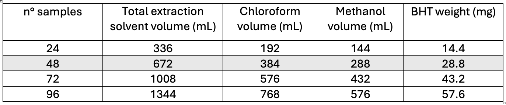
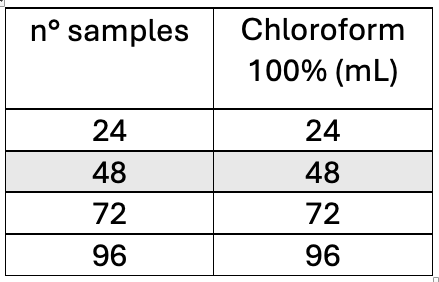
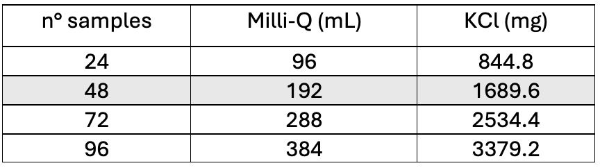
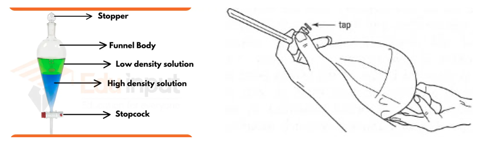
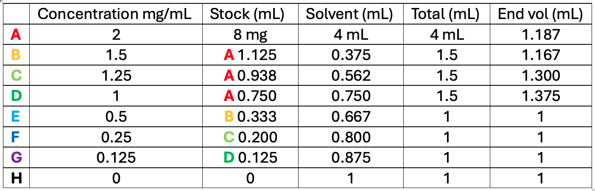

  

---

# Coral total lipid extraction and analysis
### Adapted and detailed from: Keyla Plichon [DOI: 10.17504/protocols.io.81wgbx681lpk/v1] 
**Author(s):** Dr. Chloe Carbonne  
**Lab:** Sawall Lab / MABEE Lab  
**Version:** v1.0  
**Date:** 2025-03-20 

---

## Contents

- [Materials & Reagents](#Materials_reagents)
- [Equipment](#Equipment)
- [Chemicals](#Chemicals)
- [Sample Preparation](#Sample_preparation)
- [Preparation of the Solvents](#Preparation_solvents)
- [Lipid Extraction](#Lipid_extraction)
- [Lipid Quantification with the Phospho-Vanillin Method](#Phospho_vanillin_method)

---

<h2 id="Materials_reagents">Materials & Reagents</h2>

$\square$ Liquid scintillation vial with attached cap 20 mL  
$\square$ Glass syringes 10 mL  
$\square$ Glass conical centrifuge tubes with phenolic cap 15 mL  
$\square$ Glass bottles (volume capacity depends on the samples treated each day)  
$\square$ Glass separatory funnels 50 mL  
$\square$ Glass beakers (volume capacity depends on the samples treated each day)  
$\square$ Glass graduate cylinders (volume capacity depends on the samples treated each day)
$\square$ Aluminum paper sheets (for weight boats and plate coverage) 
$\square$ Glass 96-well plates with glass lid  
$\square$ Multi-channel pipette 200 μL  
$\square$ 2 mL centrifuge tubes for the standard  

---

<h2 id="Equipment">Equipment</h2>

$\square$ -80 °C freezer  
$\square$ Weighing balance accurate to 4 decimal places  
$\square$ Freeze Dryer  
$\square$ Fume hood  
$\square$ Sonicator probe  
$\square$ Digital clock  
$\square$ Centrifuge  
$\square$ Absorbance plate reader  
$\square$ Dremmel with diamond wheel  
$\square$ Water bath 90°C  
$\square$ Heater-shaker 37°C  

---

<h2 id="Chemicals">Chemicals</h2>

$\square$ Milli-Q water  
$\square$ Chloroform 100%  
$\square$ Methanol 100%  
$\square$ Butylated hydroxytoluene (BHT powder) 
$\square$ KCl (powder) 
$\square$ Cholesterol  
$\square$ Concentrated phosphoric acid 80–100%  
$\square$ Vanillin (powder)
$\square$ Pure sulfuric acid 100%  

---

<h2 id="Sample_preparation">Sample Preparation</h2>

1. Make sure the coral sample fits in the 20 mL glass vial. If needed, cut it with the Dremel.

2. Take a picture of the coral fragment ~1 cm² with a ruler for surface area or a video for 3D reconstruction.

3. Rinse the sample in MilliQ water for 5 min in the 20 mL vial to remove the salts  
**(be careful with Millepora samples, no harsh rinsing or direct sprinkler bottle on the tissue, or they will detach from the skeleton)**.  
Empty the vial of the water.

:snowflake: **The samples can be stored in the -80 freezer before the next step**. :snowflake:

4. Dehydrate the samples in the freeze dryer. Unscrew the cap and leave it in the freeze dryer next to the samples. Follow the protocol on how to use the freeze dryer in the room of the autoclave. Leave the samples to dehydrate overnight. The next morning screw the lid and store the samples in the -80°C freezer.

:snowflake: **The samples can be stored in the -80 freezer before the next step**. :snowflake:

---

<h2 id="Preparation_solvents">Preparation of the Solvents</h2>

<strong>Make sure every step with solvent is done under the fume hood in glass dishes, chloroform is highly toxic and melts plastic.</strong>

5. **Extraction solvent:** 2:1 (v/v) chloroform:methanol + 50 mg/L butylated hydroxytoluene (BHT)

  

6. Stock container with 100% chloroform (100 mL bottle)

  

7. **Potassium chloride, 0.88% solution**: dissolve the KCl powder in Milli-Q water.

  

---

<h2 id="Lipid_extraction">Lipid Extraction</h2>

You can prepare the samples by batches of 12, as we have 2 × 6 separatory funnels. If you want to do 24 samples in one day, plan to have time to clean and dry the separatory funnels after the first 12 samples.

8. **Extract lipids:** Pour 10 mL of the extraction chloroform:methanol solution with the glass syringe into the glass extraction vial containing the freeze-dried sample. Record the time of solvent addition.

9. Sonicate with the sonication probe five times for 10 s.  
:snowflake: **[Keep the vial on ice during sonication]** :snowflake:
Make sure you touch the tissue but do not touch the glass vial. Make pauses between if needed, as it will cause heat.  
Add 30 min of sonication in a sonication bath for Porites and Montastrea.  
For Millepora, 3 × 10 s of probe sonication and 10 min of sonication bath.  
Store the vial in the dark for two hours at room temperature.

10. After two hours, pour the lipid supernatant into a glass centrifuge tube with the help of the small glass funnel. Using a 10 mL glass syringe, dispense 2 mL of the extraction solvent into the extraction vial and pour the rinse into the centrifuge tube. Clean the glass funnel with chloroform in between samples.

11. Centrifuge the glass centrifuge tubes to pellet the skeleton crystals and other debris.

:cyclone: **3000 rpm, room temperature, 00:05:00** :cyclone:

  

12. **Purify lipid extracts** (see the video in the Google drive): Prepare the annotated 20 mL vials under each separatory funnel. Pour the lipid extract into the corresponding separatory funnel, the stopcock in the closed position. Add 4 mL of the 0.88 % KCl solution and place the stopper (use the 1000 uL pipette). Gently invert the funnel, with the tip up in a 45° angle **looking towards the fumehood**. Shake the funnel three times making sure to release the pressure in between. Wait until the two phases are well separated.

13. **Drain lipid extract**: remove the stopper (it will not pour if you forget to take it off, if it’s the case close the stopcock and take the stopper off) and drain the lower organic phase into the corresponding 20 mL glass vial, making sure not to let pass of the aqueous (white) phase in. (If any goes through, pour the containt of the 20mL vial back into the separatory funnel and shake it again, and use a new 20 mL glass vial). 

14. **Rince the aqueous phase**: add 1 mL of chloroform in the separatory funnels place the stopper back (use the 1000 uL pipette :warning: with filtered pipette tips :warning:, chloroform will damage **PERMANENTLY** the pipette if the tips are not filtered). Gently invert the funnel, with the tip up at a 45° angle looking towards the fumehood. Shake the funnel three times, making sure to release the pressure in between. Wait until the two phases are well separated. Remove the stopper and drain the lower organic phase into the corresponding 20 mL glass vial, making sure not to let pass of the aqueous (white) phase in. Get rid of the aqueous phase in the chemical waste “chloroform, methanol, KCl, BHT”

15. **Evaporation**: Open the cap of the 20mL glass vials **under the fumehood** and leave them overnight to evaporate. 

:snowflake: **The samples can be stored in the -80 freezer before the next step**. :snowflake:

<h2 id="Phospho_vanillin_method">Lipid Quantification with the Phospho-Vanillin Method</h2>

:rotating_light: **BE EXTREMELY CAREFUL Sulfuric acid is very corrosive, wear double gloves, a lab coat, glasses, and do everything under the fume hood.** :rotating_light:

**Before starting**: warm up Liza’s water bath to 90°C (MilliQ water inside). Adjust the elevation platform from the sonication probe and the water level to the top - 2 mm of the glass 96 well plate. Turn on Susanne’s heater-shaker to 37°C.

16. **Prepare the cholesterol standard**  
:warning: During this step, evaporation can happen extremely quickly. :warning:  
Everything needs to be on ice and stay on ice as much as possible. Actions need to be anticipated and fast. Lids and caps must be closed as soon as possible. The stock solution A has to be made in a cold 15 mL Falcon tube on ice. The solvent needs to be poured in a 15 mL Falcon tube and cooled down on ice a few minutes before use. Weighing the 8 mg cholesterol powder has to be very very precise. Make sure you get all the powder out of the aluminium boat by pipetting out the solvent on the aluminium. Make sure not too much evaporation has happened during this phase. Top up to 4 mL in the Falcon tube if the meniscus is not there. The remaining standard A has to be pipetted in a 2 mL centrifuge tube after making standard B, C, and D to avoid future evaporation. When the solutions are done, store them in -80 or -20 freezer.  
**Don’t reuse the standard from one day to another as evaporation is very fast with these solvents.**

  

17. **Prepare 17% phosphoric acid for the vanillin reagent for 4 plates**: In a 100 mL beaker resting on ice, pipette 0.8 mL of 85% phosphoric acid. :exclamation: SLOWLY :exclamation: add 3.2 mL of MilliQ water. 
:boom: [The reaction of acids with water produces a lot of heat] :boom:

18. **Prepare a stock of 0.2 mg/mL phospho-vanillin reagent**: Wrap a 20 mL glass vial in aluminium foil, the reagent is sensitive to light. Dilute the vanillin powder in the 17% phosphoric acid solution. This solution can be stored for a week in the dark. It is recommended to prepare for 4 plates unless you know you are going to run less than that for the week. With these quantities, you will not have enough to fill up 4 plates.

  

19. **Resuspension of lipid extract**: put the 20 mL glass vial with the samples lipid extracts on ice. Using the 10 mL syringe, add 4 mL to the dried lipids.

20. **Loading the glass plate**: print the plate template and write down the names of the triplicate samples and standards on the wells for reference. Tape the paper inside the fume hood to be able to check. Pour 100 μL triplicate of the cholesterol standard and lipid samples into each well of the 96-well glass plate with a filtered pipette tip. If the sample looks very concentrated, only put 50 μL of the sample to make sure the sample does not oversaturate the plate reader. **Use filtered pipette tips to avoid any damage of the pipette**. :exclamation: Don’t forget to write down the volume you pour on the plate template paper. :exclamation:

  

21. **Evaporation of the solvent**: put the glass plate in the water bath, making sure **every 10 min** that the plate is at least **halfway** into the water on top of the platform with no lid. Let the solvent evaporate at 90°C for 30 min. Don’t close the water bath lid to avoid water dripping onto the plate.

22. **Add the 100% sulfuric acid**: Take the plate out of the water bath and leave it to cool down at ambient temperature for 5 min (the plate still needs to be warm, but not too hot). :rotating_light: BE EXTREMELY CAREFUL :rotating_light: Sulfuric acid is very corrosive, wear double gloves, a lab coat, glasses, and do everything under the fume hood. Clean every droplet that might fall on the bench. Pour a little bit of 100% sulfuric acid into the glass multipipette cuvette (for one plate, we need 9.6 mL). Pour 100 μL of sulfuric acid in each well using the multipipette with filtered tips (even if you poured only 50 μL of samples). Do not reuse the leftover sulfuric acid from one plate to another. It oxidizes very fast and messes up the results. If you have any extra sulfuric acid on the cuvette, dispose of it in the “sulfuric acid, phospho-vanillin” waste bottle. Put the waste bottle on ice and pour very slowly the leftover sulfuric acid. Make sure to rinse the cuvette properly.

23. **Mix the sulfuric acid with the lipids**: Sometimes a black or brown precipitate appears. To get rid of it, directly use Susanne’s heater-shaker around 300–350 rpm for 5 min or more if needed, with a plastic lid on the glass plate to avoid any spill. You can add some gentle hand tapping on the side of the plate.

24. **Heat the plate**: put the plate in the 90°C water bath again for 20 min. Make sure that the plate is always in contact with water at least halfway. No plate lid to avoid water condensation, and don’t close the water bath lid.

25. **Read the background absorbance in the plate reader**: Let the plate cool down for 5 min. Open the software and use the protocol called “Chloe_lipids” that reads the plate at 540 nm. Cover the plate with the glass plate lid and read the plate.

26. **Add the phospho-vanillin reagent**: add 50 μL of the reagent in each well using a multipipette.

27. **Final incubation: cover the plate with the plastic lid, wrap the plate with aluminium foil, making sure to keep the plate straight. Write “TOP” on top of the aluminium to make sure of the top of the plate and avoid accidents. Incubate the plate in Susanne’s heater-shaker at 37°C for 15 min at 250 rpm.

28. **Measure the final absorbance at 540 nm**: using the same protocol in the software.

29. **Determine the lipid content**: See the Excel example in the Google Drive. Subtract the background absorbance obtained in step 7.33 from each sample and then subtract the blank (mean absorbance of standard H after subtracting the background). Plot the standard results with their concentration and add the linear regression and the equation of the regression on the plot. Take off the outliers. Use the equation Y = A·X + B obtained to calculate the concentration of the samples.

30. **Normalize with the volume added to the dry lipids and the surface area.**

:snowflake: **The remaining samples can be stored in the -80 freezer**. :snowflake:
