Zoox Counts Protocol using Haemocytometer
================
Janna Hynds
Last edited: 21/07/2026 by Janna Hynds

- [Before Using the Microscope](#before-using-the-microscope)
- [Before Doing Zoox Counts](#before-doing-zoox-counts)
- [To Log the Microscope](#to-log-the-microscope)
  - [Logging into the Computer](#logging-into-the-computer)
- [To Turn On the Microscope](#to-turn-on-the-microscope)
  - [Turning On the Computer Program](#turning-on-the-computer-program)
- [Using the Microscope and Program](#using-the-microscope-and-program)
  - [Microscope Settings for Symbiont
    Imaging](#microscope-settings-for-symbiont-imaging)
  - [To Take Images](#to-take-images)
  - [To See the Images](#to-see-the-images)
- [Preparing Your Samples](#preparing-your-samples)
- [Calculating Symbiont Density Using
  ImageJ](#calculating-symbiont-density-using-imagej)
  - [To Install CounZoox.ijm](#to-install-counzooxijm)
  - [To Change Image Formats on
    ImageJ](#to-change-image-formats-on-imagej)
  - [To Measure Images on ImageJ](#to-measure-images-on-imagej)
  - [Recording Results in Excel](#recording-results-in-excel)
    - [Density Calculation Reference](#density-calculation-reference)
- [Symbiont Counts Analysis](#symbiont-counts-analysis)
  - [Load Data](#load-data)
  - [Creating New Data Frame with Necessary
    Columns](#creating-new-data-frame-with-necessary-columns)
  - [Build New Data Frame](#build-new-data-frame)
  - [Sorting by Treatment and
    Species](#sorting-by-treatment-and-species)
  - [Symbiont Graph by Treatment](#symbiont-graph-by-treatment)


> **DISCLAIMER**
>
> This protocol is based on using “Brian,” the [Olympus
> IX83](https://bios.asu.edu/sites/g/files/litvpz726/files/2024-02/Olympus_IX-83.pdf)
> microscope at the [BIOS microscope
> room](https://bios.asu.edu/research/facilities/microscopy-and-image-analysis-facility).
>
> This protocol also assumes the user knows how to work a basic
> microscope (e.g., knobs, stages, etc.).

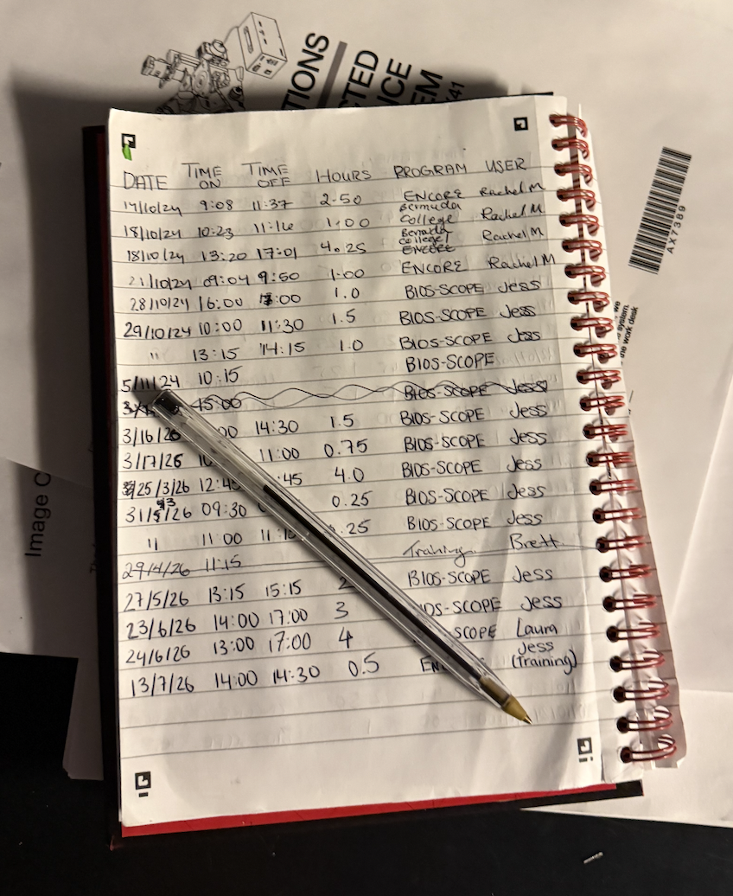

# Before Using the Microscope

Email/arrange for someone to email Jess (Lab tech) and CC Rachel Parsons
to let them know when you want to use the microscope/ask for
availability. There is an Outlook calendar in place as well. Be sure to
do both just in case.

# Before Doing Zoox Counts

Make sure your samples thaw on ice so that when it comes time to use the
microscope, your samples are ready to go. You’ll need:

- Kim wipes
- Isopropanol or MQ
- A couple of beakers for pipette tips and waste
- Pipette and tips
- Your haemocytometer

# To Log the Microscope

Log the microscope every time you use it. This includes:

- The date
- Time you start using it
- Time you stop using it
- Time in hours (typically just round your start and end times so the
  hour calculation is easier)
- Your program (our lab is ENCORE for now)
- The user (your name)

Brian is the microscope for this protocol (member of Queen). **Take the
blue slip cover off** the microscope.

## Logging into the Computer

The computer password is on the computer (or `BIOS1904` as of when this
protocol was written). It is a slow microscope, so be gentle and
patient.

# To Turn On the Microscope

Everything is labeled. Start with the switch labeled “before \#1” and
then follow each number until you get to \#5 (pictures below).

<div style="display:flex; gap:10px;">

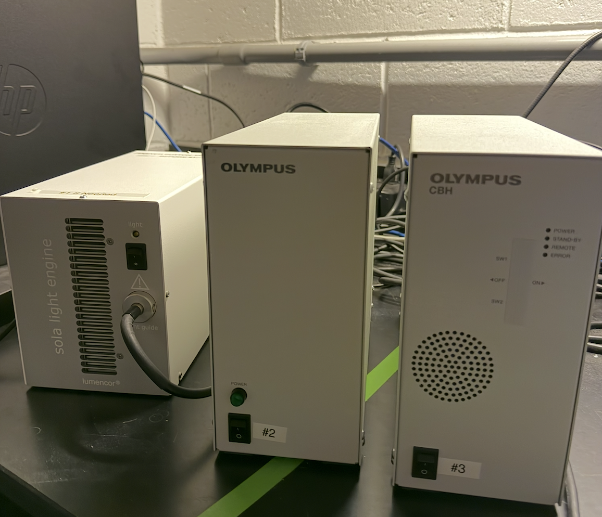
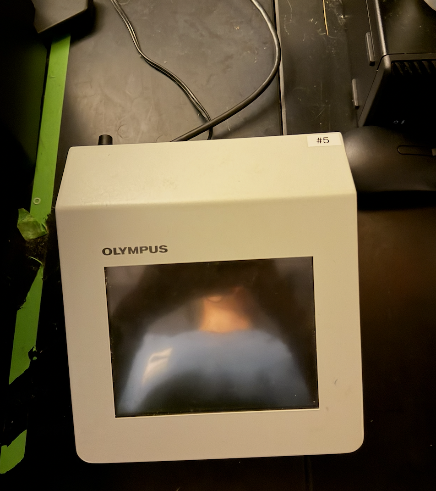
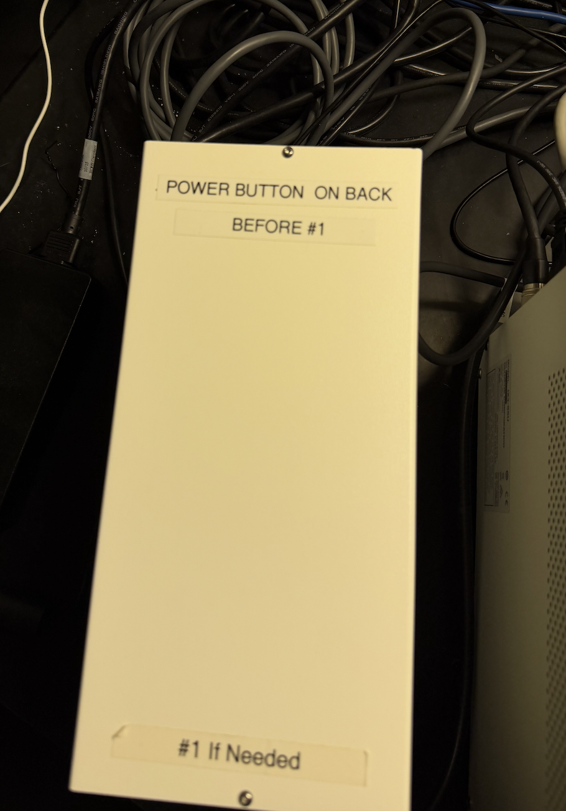

</div>

Once the \#5 box says “start operation,” you’re set to start up the
computer program.

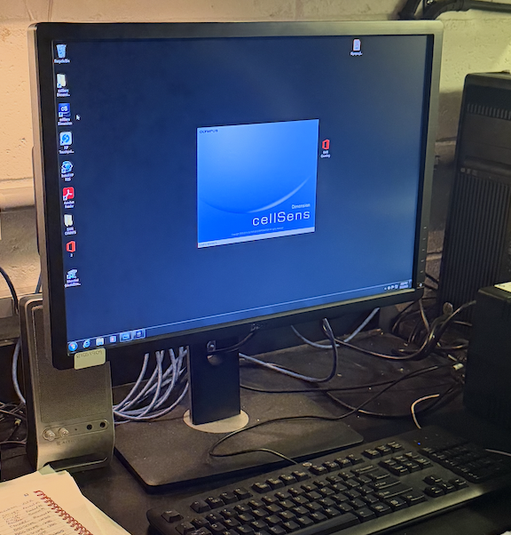

## Turning On the Computer Program

The program is called **“CellSens Dimension.”** It should be right on
the desktop. Click this to open it.

If any pop-ups come up, typically just press “No” (e.g., ~something
about executing~, just press No). The program will open automatically.

# Using the Microscope and Program

The CellSens program has the same controls as the \#5 box, pictured
below.

There are objectives including BF (brightfield), DAPI, FITC, Cy3, and
Cy5, which are the ones our lab has used in the past.

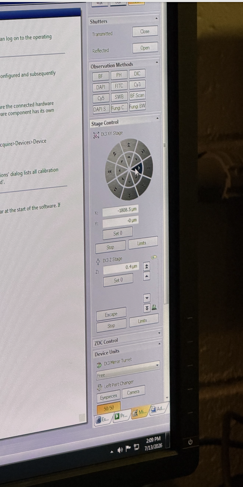

For zoox counts, we use the **4x magnification**, so there is no need
for immersion oil.

To control the stage, sometimes the physical knobs can be broken, so you
can use the arrows on the right panel of the computer program (pictured
below).

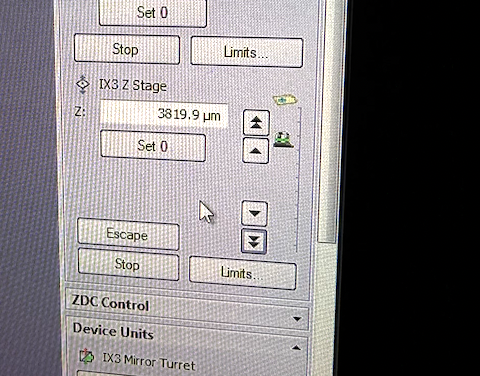

To control the focus, you can use the physical knobs or you can use the
arrows.

Since we will be taking pictures of the haemocytometer, select the
**DP27** camera option, pictured below. The other one is in black and
white.

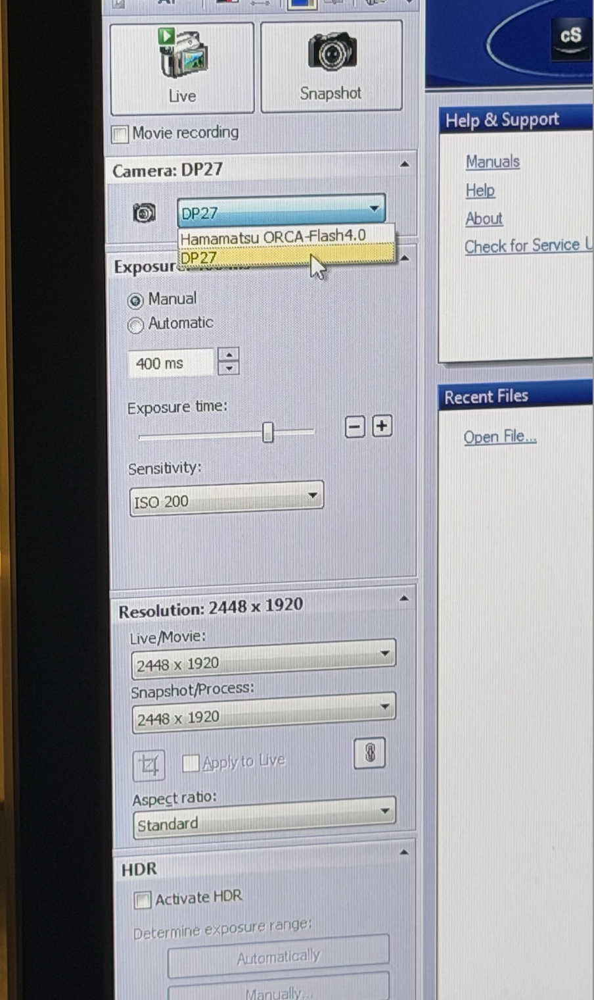

After you’ve selected your objective, magnification, and turned
everything on, selecting **“Live”** will give you a live image of what’s
in the microscope.

To adjust the image you see, you can use the exposure slider on the left
panel of the computer (a blank hemo in BF will show up at around 30%
exposure), or you can use the 2 knobs.

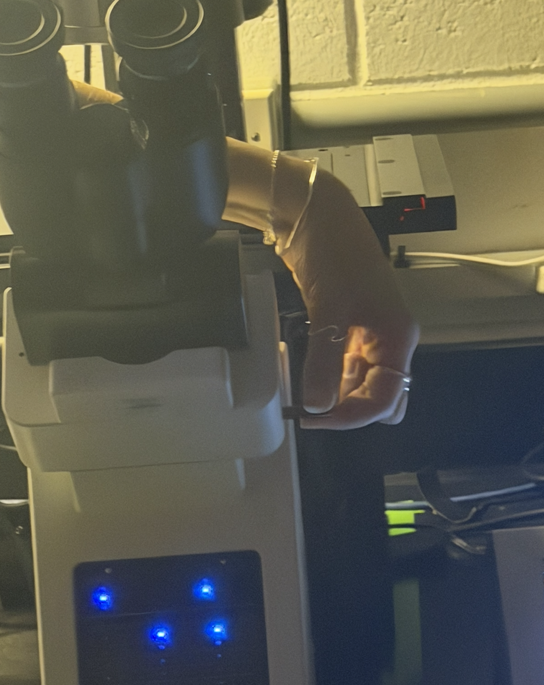

There is a column on the right of the microscope that slides in and out,
which can control the camera view.

This is an **inverted microscope**, so when you load the haemocytometer,
you have to flip it upside down.

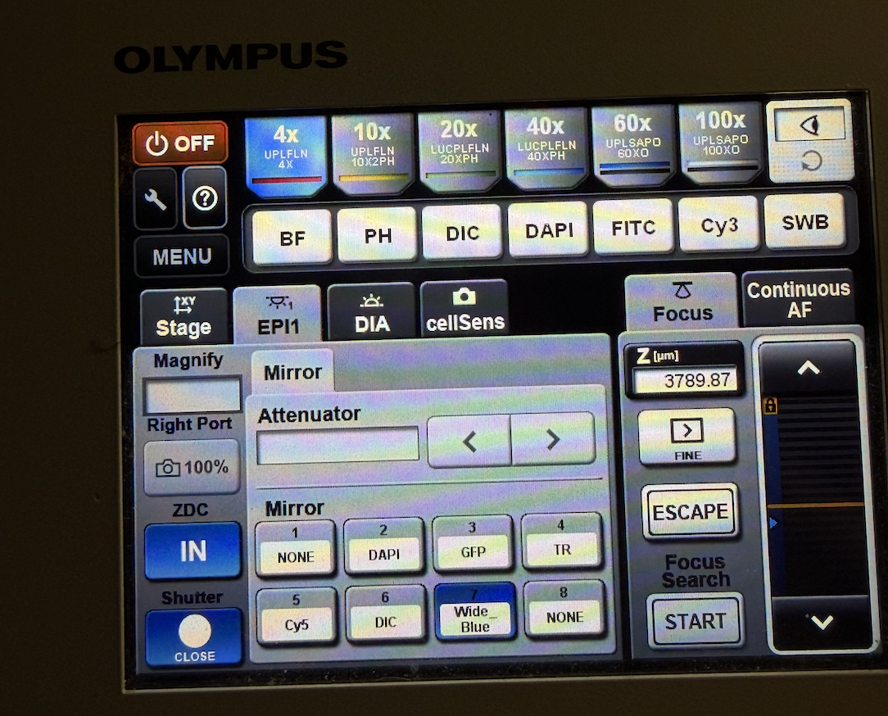

## Microscope Settings for Symbiont Imaging

This is what the Olympus screen should look like when imaging: **4x**
imaging, **EPI1**, **Wide blue (7)**, and you open and close the shutter
in the bottom left corner when you’re using it.

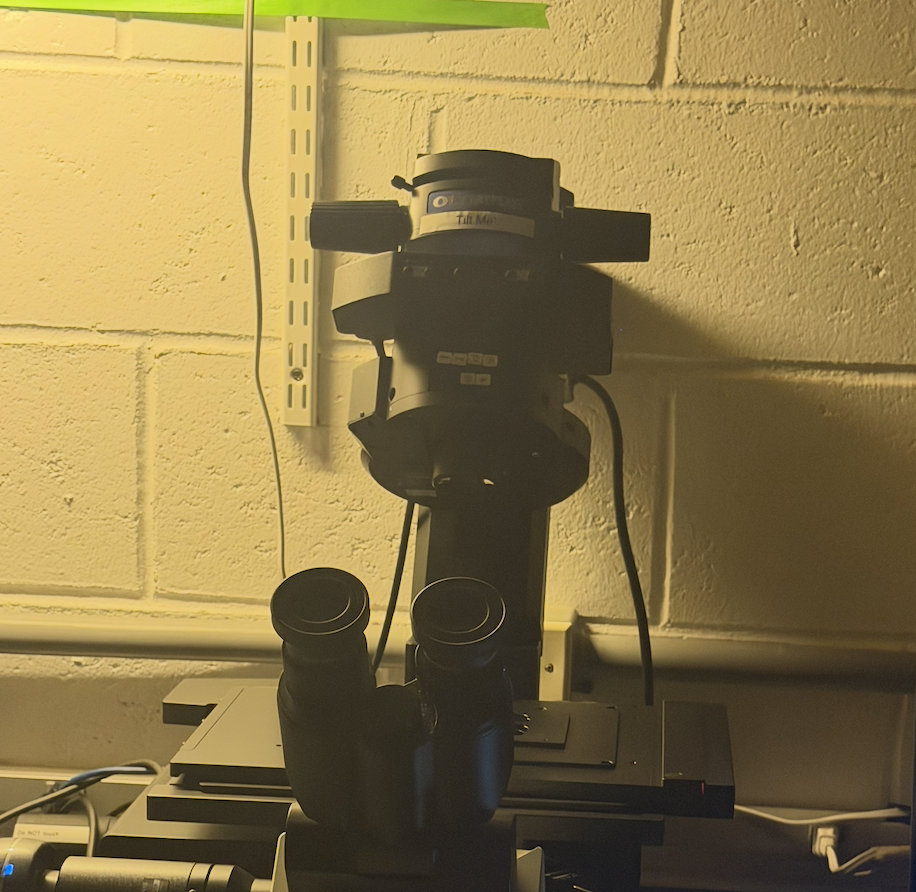

**To load the haemocytometer onto the microscope**, the head of the
microscope pushes back towards the wall to give you more space, but be
careful, as it will hit the wall.

We've noticed that pulling the slider (column) all the way out to adjust the
amount of light/exposure is the easiest way to find your cells in Wide blue.
They'll be a faint red and then you can adjust the exposure on the 
screen/computer program.

## To Take Images

Once you have your symbionts in focus, press **snapshot**.

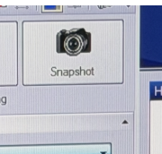

The image will load on the top bar. Make sure you’re on **DP27**!

The photos will autosave to a folder named for the day you’re taking
them.

## To See the Images

Navigate to:

    C: drive → users → localadmin → BIOS → [the day you're taking the images]

You can either take note in your notebook of the image number that
corresponds to your sample number, or you can cut and paste your images
into the Z drive in groups/folder names/etc. In the Z drive, our lab’s
folder is **ENCORE**.

Below is an example of what the symbionts should look like on the image.

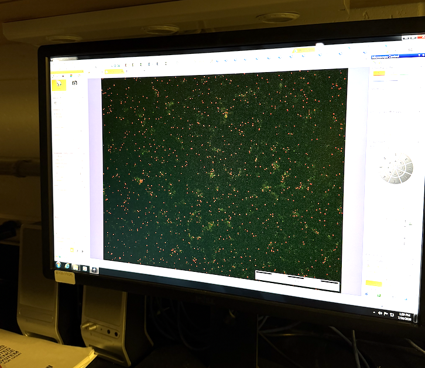

# Preparing Your Samples

Your samples should be in slurry (rather than frozen) and ready to go
when the time comes to image the zoox counts.

The following are materials you’ll need on the lab bench:

- Kimwipes
- Squirt bottle of MQ
- 2 large beakers (or something of similar shape)
- Neubauer haemocytometer and coverslip
- 100–1000 µL pipette and tips
- Samples on ice
- Notebook to track samples and imaging

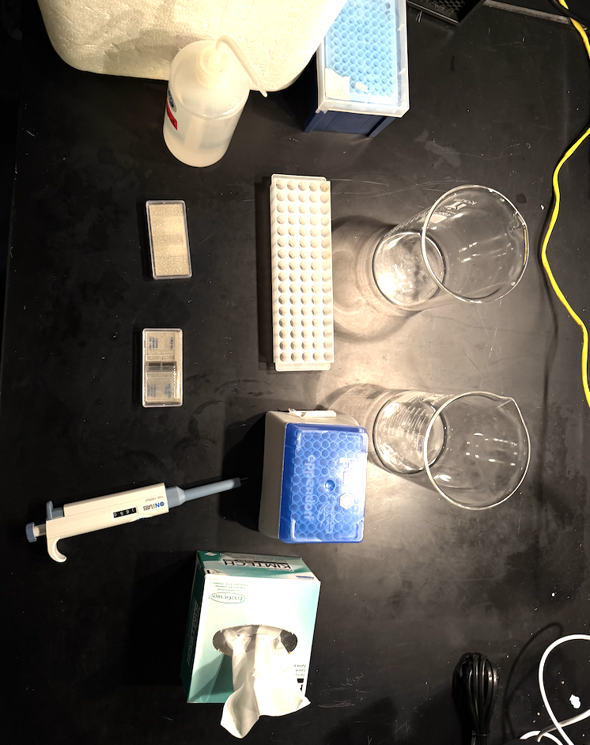

Once your samples are thawed, you can prepare your hemocytometer.

Place the coverslip on the center of the hemocytometer in the middle.

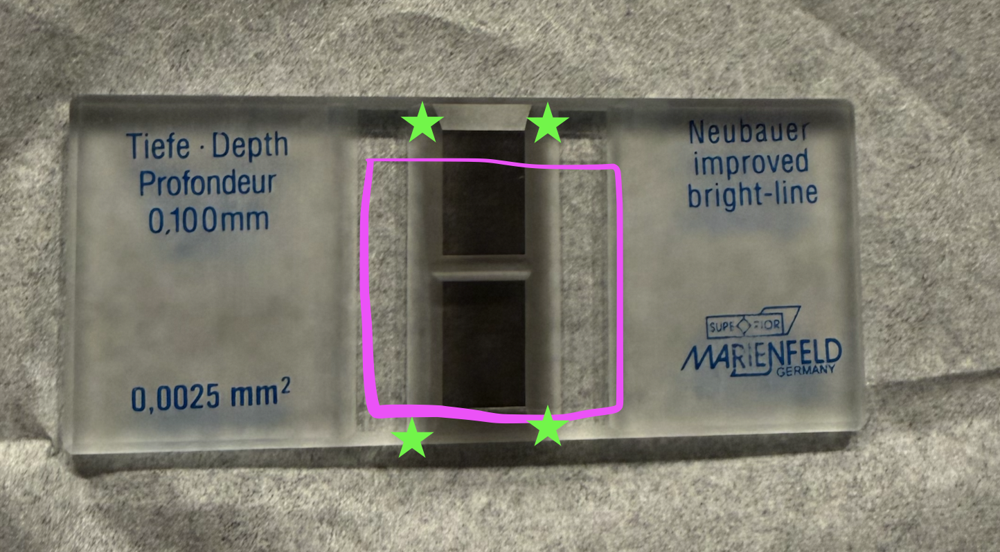
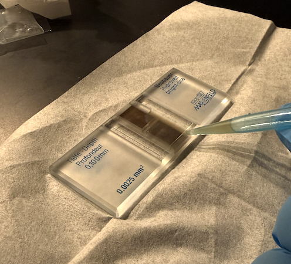

Invert your slurry a few times to mix up the zoox. There should not be a
pellet at the bottom — rather, everything should be in suspension, all
one slurry.

Fill your pipette with **200 µL** of slurry and insert it into the divot
marked with a red dot at around a **45-degree angle**. Press down on the
pipette slowly to inject your slurry into the haemocytometer and fill
both grey grids and side divots.

Be sure not to overfill, as sometimes the slurry will overflow on top of
the coverslip. The slurry will create surface tension between the
coverslip and the haemocytometer.

When finished, flip the haemocytometer upside down and place it on the
microscope in the center. The light should be centered on one of the
grey grids (you will not see the grid on the camera).

When taking photos, be sure to take 2 — one on each grey grid/rectangle.

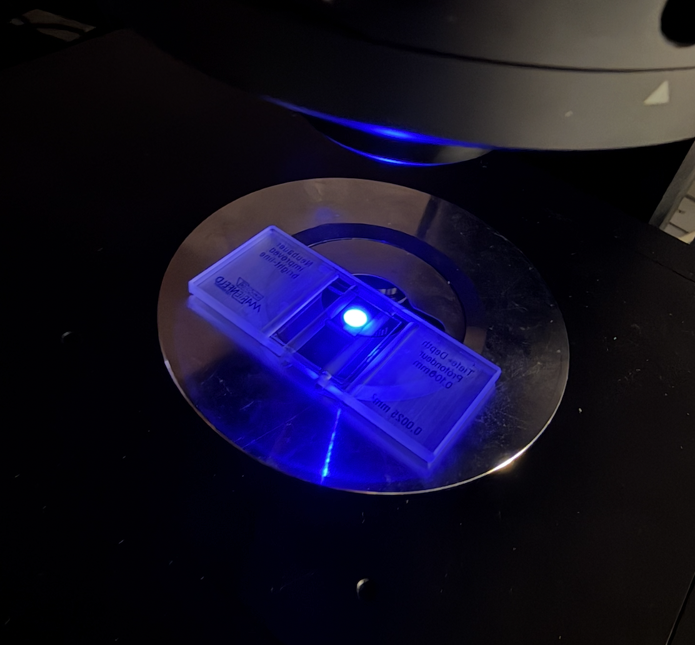

# Calculating Symbiont Density Using ImageJ

Download ImageJ (Fiji): <https://imagej.net/software/fiji/downloads>

## To Install CounZoox.ijm

1.  Open ImageJ
2.  Plugins → Macros → Install → `CounZoox.ijm`

## To Change Image Formats on ImageJ

Go to: Applications → Fiji (right-click) → Show Package Contents →
macros → (right-click) on CounZoox → Open Text Editor.

Look for the image types in the file, and add your type of image (e.g.,
`tif`, `TIF`, `TIFF`, `jpeg`, etc.).

## To Measure Images on ImageJ

1.  Open image
2.  **\[9\]** initiate variables and results table (Plugins → Macros →
    Init)
3.  **\[0\]** to define parameters (Plugins → Macros → Edit parameters)
    1.  # channel to threshold: `1`

    2.  Alga threshold \[0 to reboot\]: `0`

    3.  Alga diameter \[min-max\] in µm: `4-14`

    4.  \* range of min-max
4.  **\[1\]** starts measuring

Plugins → Macros → Measure current

Confirm the threshold. Once you have measured one accurately, and you
are getting an accurate N.alga, you can batch measure your folder of
images:

Plugins → Macros → Batch → Select the folder with your images

## Recording Results in Excel

Your spreadsheet should have these headers/columns (give or take some
automated ones from the script). The columns marked **(script output)**
are the columns/counts that the script gives you.

| Directory | coral_ID   | haemo_replicate | day | N.alga | C.Alga_per_pxl3 | Est_vol_pxl2 | Cam_Sz   | Surface_um2 | Volume_um3 | zx_um3 |  zx_mL |
|:----------|:-----------|----------------:|:----|-------:|----------------:|-------------:|:---------|------------:|-----------:|-------:|-------:|
| blahblah  | M2_984     |               1 | D21 |    563 |        0.000390 |      1223680 | 1280x956 |     7648000 |  764800000 |  7e-07 | 736000 |
| blah      | M2_984     |               2 | D21 |    639 |        0.000443 |      1223680 | 1280x956 |     7648000 |  764800000 |  8e-07 | 836000 |

Example counts spreadsheet (N.alga and C.Alga per pxl^3 are script
outputs)

The grid on the haemocytometer is **3x3 mm**, so measure out 1 mm in
pixels.

The space between the coverslip and the microscope slide is 0.100 mm, or
100 µm.

*Example: We measured 433.0185 pixels per 1 mm, or (433.0185/1000) =
0.433 µm.*
*Example: We measured 400 pixels per 1 mm, or (400/1000) =
0.400 µm.*

Your **Cam Sz** is the number of pixels on one surface of the camera
(e.g., 1280x956). This can be found in the top left corner of the images
you take on the microscope.

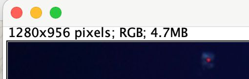

### Density Calculation Reference

The following conversions and worked example (Cam Sz = 1280x956, N.alga
= 563) are used to go from a raw camera image to a symbiont density in
cells/mL.

- 1 mm = 400 pixels → 1 pixel = 0.0025 mm = 2.5 µm
- 1 pixel² = 6.25 µm²
- `Surface_µm²` = `Est. vol. (pxl²)` × 6.25 µm²
- `Volume_µm³` = `Surface_µm²` × 100 (the 100 µm coverslip-to-slide
  depth)
- `zx_µm³` = `N.alga` / `Volume_µm³`
- `zx_mL` = `zx_µm³` / 10⁻¹²

**Worked example (Cam Sz = 1280x956, N.alga = 563):**

| Quantity           | Value       |
|:-------------------|:------------|
| Est. vol. (pxl²)   | 1,223,680   |
| Surface_µm²        | 7,648,000   |
| Volume_µm³         | 764,800,000 |
| zx_µm³ (cells/µm³) | 7.36e-07    |
| zx_mL (cells/mL)   | 7.36e+05    |

You can reuse this calculation for any new image: just update the Cam Sz
(from the image’s top-left pixel dimensions) and N.alga (the
CounZoox.ijm output) to get zx_mL for that sample.

# Symbiont Counts Analysis

The section below takes the per-image `zx_mL` densities calculated above
(exported into a counts spreadsheet, one row per image/replicate) and
combines them with a coral surface-area spreadsheet to get symbiont
density normalized to coral surface area (`zx_cm2`), then compares that
across treatments and species. Update the file names, column names, and
day/treatment labels in the first chunk to match your own data set —
everything downstream is written generically off those columns.

``` r
# Packages needed for the analysis below:
#   dplyr    -> data wrangling (select/mutate/filter/join/group_by/summarise)
#   ggplot2  -> plotting
#   Rmisc    -> summarySE() for summary stats (mean, sd, se, CI) by group
library(dplyr)
library(ggplot2)
library(Rmisc)
```

## Load Data

``` r
# --- EDIT THESE FILE PATHS to point at your own exported CSVs ---
# sym_dat:      one row per image/replicate, with the zx_mL density calculated
#               in the "Density Calculation Reference" section above
# surface_area: one row per coral fragment, with its measured surface area
sym_dat      <- read.csv("SymbiontCounts2024_AUindoor.csv",
                          header = TRUE, stringsAsFactors = FALSE)
surface_area <- read.csv("Indoorfrags_SA.csv",
                          header = TRUE, stringsAsFactors = FALSE)

# Blank cells (e.g. "" or "  ") are read in as empty strings, not NA.
# Convert any blank/whitespace-only cell in either data frame to a proper NA
# so downstream numeric conversion and filtering (is.na()) work correctly.
sym_dat[]      <- lapply(sym_dat,      function(x) ifelse(trimws(x) == "", NA, x))
surface_area[] <- lapply(surface_area, function(x) ifelse(trimws(x) == "", NA, x))

# Quick sanity check of the imported surface-area data (column names/types)
str(surface_area)
```

## Creating New Data Frame with Necessary Columns

``` r
# --- surface-area table ---
# Rename columns to a common naming scheme, coerce to the right types,
# and drop any fragment that has no surface-area measurement.
# EDIT the right-hand column names (frag_number, surface_areacm2, etc.)
# to match whatever your surface-area CSV actually calls them.
sa_cols <- surface_area %>%
  select(
    coral_ID     = frag_number,
    day,
    slurry_mL,
    treatment,
    species,
    surface_area = surface_areacm2
  ) %>%
  mutate(
    slurry_mL    = as.numeric(slurry_mL),
    surface_area = as.numeric(surface_area),
    day          = trimws(day),
    coral_ID     = trimws(coral_ID)
  ) %>%
  filter(
    !is.na(surface_area)
  )

# --- symbiont-count table ---
# Same idea: rename to the common naming scheme, coerce types, and keep
# only the sampling days you actually want to analyze.
# EDIT the column names on the right (coral_id, haemo_replicate, zx_mL)
# and the vector of day labels in filter() to match your own data set.
sym_cols <- sym_dat %>%
  select(
    coral_ID = coral_id,
    day,
    tissue   = haemo_replicate,
    zx_mL
  ) %>%
  mutate(
    zx_mL    = as.numeric(zx_mL),
    day      = trimws(day),
    coral_ID = trimws(coral_ID)
  ) %>%
  filter(
    day %in% c("D-8", "D21", "D46")   # EDIT: your own timepoint labels
  )
```

## Build New Data Frame

``` r
# Join the symbiont counts to their matching coral's surface area (by
# coral_ID + day), then average zx_mL across replicates for each
# coral/day/treatment/species combination.
#
# Finally, convert density-per-mL-of-slurry into density-per-cm2-of-coral:
#   zx_cm2 = zx_mL * slurry_mL / surface_area / 1e5
# (the /1e5 rescales into units of 10^5 cells/cm2, matching the plot below)
zx_table <- sym_cols %>%
  left_join(sa_cols, by = c("coral_ID", "day"))

# Quick check: how many rows actually got a valid zx_cm2 value, and what
# does the overall distribution look like? (making sure you don't have NA or mismatch)
cat("\n--- zx per cm² summary (all days) ---\n")
print(summary(zx_table$zx_cm2))
cat("\nCalculated for", sum(!is.na(zx_table$zx_cm2)), "of", nrow(zx_table), "rows.\n")
```

## Sorting by Treatment and Species

``` r
# Subset to a single timepoint of interest (EDIT "D46" to your timepoint)
# and drop rows with no valid zx_cm2.
zx_D46 <- zx_table %>%
  filter(day == "D46", !is.na(zx_cm2))   # EDIT: day label to analyze

cat("\n--- D46 zx_cm2 summary ---\n")
print(summary(zx_D46$zx_cm2))
cat("Mean:", mean(zx_D46$zx_cm2, na.rm = TRUE), "x10^5 cells/cm²\n")
cat("n =", nrow(zx_D46), "\n")

# summarySE() (from Rmisc) computes n, mean, sd, se, and 95% CI of zx_cm2
# for each group -- once grouped only by treatment, and once by
# treatment + species, for whichever comparison you want to plot/report.
zx_sum_trt <- summarySE(data       = zx_D46,
                         measurevar = "zx_cm2",
                         groupvars  = "treatment",
                         na.rm      = TRUE)

zx_sum_sp  <- summarySE(data       = zx_D46,
                         measurevar = "zx_cm2",
                         groupvars  = c("treatment", "species"),
                         na.rm      = TRUE)

# EDIT these to your own treatment names/colors -- this just fixes the
# plotting order (trt_order) and assigns a consistent color per treatment
# (trt_colors) so every plot using this data uses the same scheme.
trt_order  <- c("ambient", "AU_8h", "heated")
trt_colors <- c("ambient" = "goldenrod1",
                 "AU_8h"   = "deepskyblue",
                 "heated"  = "firebrick2")

zx_D46$treatment     <- factor(zx_D46$treatment,     levels = trt_order)
zx_sum_trt$treatment <- factor(zx_sum_trt$treatment, levels = trt_order)
zx_sum_sp$treatment  <- factor(zx_sum_sp$treatment,  levels = trt_order)
```

## Symbiont Graph by Treatment

``` r
# Boxplot of symbiont density by treatment, with:
#  - individual points jittered on top (geom_jitter) so you can see spread
#  - a blue dot marking the group mean (stat_summary)
#  - a fixed color per treatment (trt_colors, defined above)
# EDIT the title/axis labels and trt_colors above to match your own study.
zx_graph_trt <- ggplot(zx_D46,
                       aes(x = treatment, y = zx_cm2, fill = treatment)) +
  geom_boxplot(outlier.shape = NA, alpha = 0.7, width = 0.5, color = "grey30") +
  geom_jitter(aes(color = treatment), width = 0.15, size = 2, alpha = 0.7) +
  stat_summary(fun = mean, geom = "point",
               shape = 20, size = 5, color = "blue", fill = "blue") +
  scale_fill_manual(values  = trt_colors) +
  scale_color_manual(values = trt_colors) +
  scale_x_discrete(guide = guide_axis(angle = 90)) +
  ylab(bquote('Symbiont density (' * 10^5 * ' cells cm'^-2 * ')')) +
  xlab("Treatment") +
  ggtitle("Indoor Symbiont Density by Treatment — D45") +
  theme_bw() +
  theme(legend.position = "left",
        plot.title      = element_text(face = "bold", hjust = 0.5))

print(zx_graph_trt)
```
