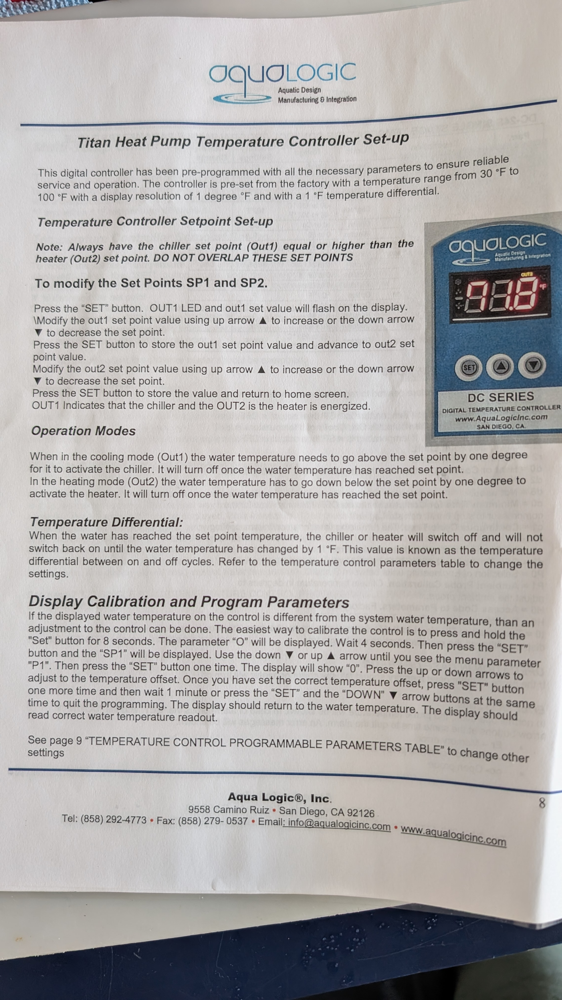
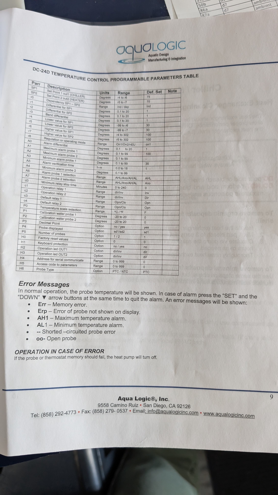

  

---

# Mesocosms Aqualogic Chiller/heaters temperature controller setup
### Adapted from: Aqualogic manual.
**Author(s):** Dr. Chloe Carbonne  
**Lab:** Sawall Lab / MABEE Lab  
**Version:** v1.0  
**Date:** 2025-12-27

## Overview
The preset parameters on the controller are °F between 35 to 100°, and no calibration of the sensors. This protocol will present an easy way on how to change into °C, change the range of temperature to 10-100 and calibrate the temperature sensors. 
These parameters are maintained when we turn off the pump and start it again. 

## Contents

- [Access the menu](#Access_the_menu)
- [Change from °F to °C](#Change_from_F_to_C)
- [Change the range of temperature for the lower set point](#Change_the_range)
- [Close the menu ](#Close_menu)
- [Calibrate the temperature](#Calibrate_temperature)
- [Troubleshooting](#Troubleshooting)
- [Safety Notes](#Safety_Notes)
- [Data Logging & Record-Keeping](#Data_Logging_&_Record-Keeping)
- [Versioning Notes](#Versioning_Notes)
- [References](#References)

<h2 id="Access_the_menu">Access the menu</h2>

Push the “set” button for 10 seconds. “0” will appear on the screen. Wait 4 seconds and push the “set” button again. You can go through the different setting options using :arrow_up_small: or :arrow_down_small: buttons. 

<h2 id="Change_from_F_to_C">Change from °F to °C</h2>

Go to the setting option “P0” using the  :arrow_up_small: or :arrow_down_small: buttons. Push “set”, you should see “°F”. Push :arrow_up_small: to get “°C” on the screen. Push “set” again to validate the change. 

<h2 id="Change_the_range">Change the range of temperature for the lower set point</h2>

Go to the setting option “r4” which will set the lower set point for the chiller, push “set”, the preset option is 35, decrease the temperature until you reach 10 or lower if needed. Push “set” to validate. Go to the setting option “r5” which will set the lower set point for the heater, push “set”, and decrease the temperature until you reach 10 or lower if needed.

<h2 id="Close_menu">Close the menu</h2>

You can close the menu by waiting 1min or pushing “set” and :arrow_up_small: at the same time. 

<h2 id="Calibrate_temperature">Calibrate the temperature</h2>

Use a thermometer (YSI, Hanna…). Measure the temperature next to the basin’s temperature sensor. Check the difference between the thermometer and the basin’s temperature. Example: controller showing “25.6°C”, thermometer showing “25.1°C”. The temperature difference: -0.5°C. 
Go to the menu, go to the setting option “P1”, push “set”, change the value until you reach the difference measured (can be negative or positive and goes by 0.1°C). Push “set” and the calibration should be taken into account. 

<h2 id="Pictures_manual">Pictures of the manual</h2>

  

  

---