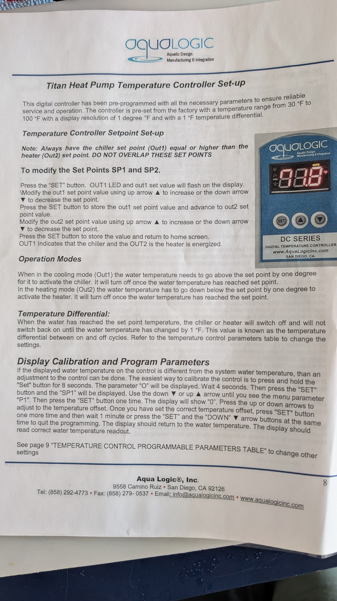
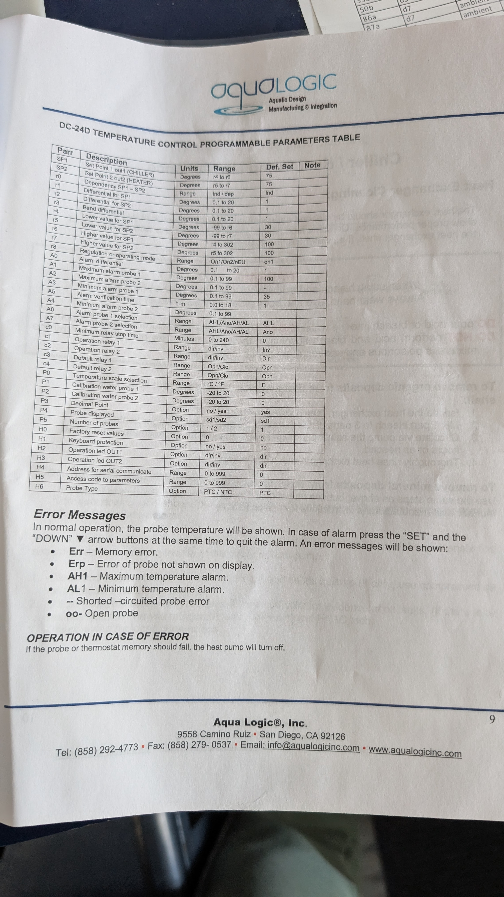

# Mesocosms Aqualogic Chiller/heaters temperature controller setup

### Adapted from: Aqualogic manual.

**Author(s):** Janna Hynds, Jacob Welter, Dr. Chloe Carbonne\
**Lab:** Sawall Lab / MABEE Lab\
**Version:** v2.0\
**Date:** 2026-09-10

## Overview
The preset parameters on the controller are °F between 35 to 100°, and no calibration of the sensors. This protocol will present an easy way on how to change into °C, change the range of temperature to 15-35 and calibrate the temperature sensors. These parameters are maintained when we turn off the pump and start it again.
## Contents
-   [Access the menu](#Access_the_menu)
-   [Change from °F to °C](#Change_from_F_to_C)
-   [Change the range of temperature for the lower set point](#Change_the_range)
-   [Close the menu](#Close_menu)
-   [Calibrate the temperature](#Calibrate_temperature)
-   [Troubleshooting](#Troubleshooting)
-   [Safety Notes](#Safety_Notes)
-   [Data Logging & Record-Keeping](#Data_Logging_&_Record-Keeping)
-   [Versioning Notes](#Versioning_Notes)
-   [References](#References)
<h2 id="Access_the_menu">
Access the menu
</h2>
Push the “set” button for 10 seconds. “0” will appear on the screen. Wait 4 seconds and push the “set” button again. You can go through the different setting options using :arrow_up_small: or :arrow_down_small: buttons.
<h2 id="Change_from_F_to_C">
Change from °F to °C
</h2>
Go to the setting option “P0” using the :arrow_up_small: or :arrow_down_small: buttons. Push “set”, you should see “°F”. Push :arrow_up_small: to get “°C” on the screen. Push “set” again to validate the change.

**Disclaimer:** The P0 setting only changes which unit label (°F vs °C) is displayed — it does not convert any of the actual numbers already programmed into the controller. Your setpoints (SP1/SP2) and the allowed setpoint range limits (parameters r4, r5, r6, r7 in the table on page 9) were still sitting at their factory Fahrenheit-appropriate values (defaults: SP1/SP2 = 75, lower limits r4/r5 = 30, upper limits r6/r7 = 100). Once you flip the label to °C, those same raw numbers are now just being displayed with a “°C” tag — which is why the readout can look wrong and why you may not be able to drag the setpoint below ~60: the controller is still enforcing the old numeric floor/ceiling. Be sure to update the setpoints and range limits (see the [High and Low Set Points](#High_and_Low_Set_Points) section) after switching units.
<h2 id="Change_the_range">
Change the range of temperature for the lower set point
</h2>
Go to the setting option “r4” which will set the lower set point for the chiller, push “set”, the preset option is 35, decrease the temperature until you reach 10 or lower if needed. Push “set” to validate. Go to the setting option “r5” which will set the lower set point for the heater, push “set”, and decrease the temperature until you reach 10 or lower if needed.
<h2 id="Close_menu">
Close the menu
</h2>
You can close the menu by waiting 1min or pushing “set” and :arrow_up_small: at the same time.
<h2 id="Calibrate_temperature">
Calibrate the temperature
</h2>
Use a thermometer (YSI, Hanna…). Measure the temperature next to the basin’s temperature sensor. Check the difference between the thermometer and the basin’s temperature. Example: controller showing “25.6°C”, thermometer showing “25.1°C”. The temperature difference: -0.5°C. Go to the menu, go to the setting option “P1”, push “set”, change the value until you reach the difference measured (can be negative or positive and goes by 0.1°C). Push “set” and the calibration should be taken into account.
<h2 id="Offset_and_Differential">
AquaLogic DC-24D: Offset &amp; Differential
</h2>
A general quick reference for changing the two most common settings.

| Setting | What it does |
|---|---|
| P1  (offset) | Shifts the display to match a trusted thermometer. P1 = true minus display, so a display reading high takes a negative value. Range −20 to +20. |
| r1  (cooling differential) | Chiller deadband. Chiller turns ON at setpoint + r1 and OFF at the setpoint. |
| r2  (heating differential) | Heater deadband. Heater turns ON at setpoint − r2 and OFF at the setpoint. |

The differential is the size of the temperature swing. Smaller holds tighter but cycles the equipment more often, using more power. Larger swings wider but is easier on the compressor. Depending on your experiment and if you’re in Celsius or Fahrenheit, you may want the swing to be either 0.3 for C or 1 degree for F.

**Enter the menu**

1.  Hold SET about 8 seconds until the display shows 0. Wait 4 seconds.
2.  Press SET. SP1 appears. You are in the parameter list.

**Change the offset (P1)**

1.  Arrow to P1 (near the end, just after P0). Pressing DOWN from SP1 wraps around and reaches it faster.
2.  Press SET, then UP / DOWN to the value (true minus display, 0.1 steps).
    For Fahrenheit experiments in the past, we’ve set the differential to 1 degree. For Celsius experiments in the past, we’ve set the differential to 0.3 degrees.
3.  Press SET to store. Exit with SET + DOWN.

**Change the differential (r1 cooling, r2 heating)**

1.  From SP1, press UP to r1 (three presses), or once more to r2.
2.  Press SET, then UP / DOWN to the value (0.1 steps).
    For Fahrenheit experiments in the past, we’ve set the differential to 1 degree. For Celsius experiments in the past, we’ve set the differential to 0.3 degrees.
3.  Press SET to store. Exit with SET + DOWN.
<h2 id="High_and_Low_Set_Points">
AquaLogic DC-24D: High and Low Set Points
</h2>

**1. Enter the full parameter menu**
Press and hold the "SET" button for about 8 seconds until "O" appears on the display. Release, wait about 4 seconds, then press SET once — the display will show "SP1". This is the start of the full parameter list (the same menu you used to calibrate the probe).

**2. Scroll to r4 (Lower value for SP1/chiller)**
Use the DOWN arrow to scroll past SP1, SP2, r0, r1, r2, r3 until you reach "r4". Press SET to select it, use UP/DOWN to set it to a sensible floor — 20 for Celsius experiments, or 50 for Fahrenheit experiments — then press SET to store and move to the next parameter.

**3. Set r5 (Lower value for SP2/heater)**
You should now be at "r5". Press SET, set it to the same floor (20 for Celsius, 50 for Fahrenheit), and press SET to store.

**4. Set r6 (Higher value for SP1/chiller)**
Continue to "r6". Press SET, set it to a sensible ceiling — 35 for Celsius experiments, or 100 for Fahrenheit experiments — and press SET to store.

**5. Set r7 (Higher value for SP2/heater)**
Continue to "r7". Press SET, set it to the same ceiling (35 for Celsius, 100 for Fahrenheit), and press SET to store.

**6. Exit and confirm P0 is still °C**
Press SET + DOWN together to quit the menu (or just let it time out after ~1 minute). Briefly check P0 still reads the unit you intend (°C or °F) — it should, since you already set that.
<h2 id="Pictures_manual">
Pictures of the manual
</h2>

------------------------------------------------------------------------
